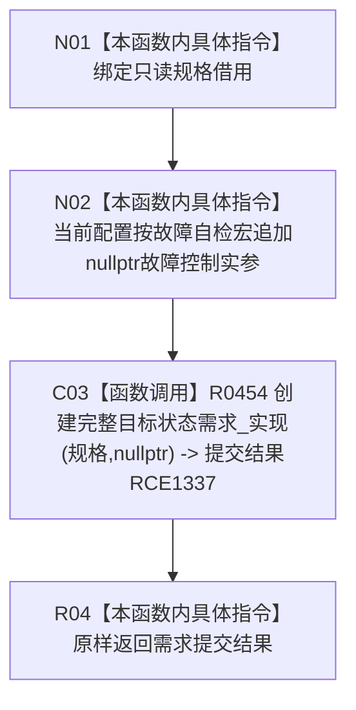

# CF-L9-0064 需求任务方法创建完整目标状态需求现状流程图

图类型：现状流程图
代码版本：`3920a74638264f9f539d50f32f3c9fe5fb1982ab`
源码 blob：`16ac9534baeda26ac8a712066e713f3339f6e0c8`
覆盖文件：`海中鱼巣/领域/数据操作.需求任务方法.ixx:1213-1219`
唯一根函数：R0431
完整签名：`需求提交结果 海中鱼巣::需求任务方法数据操作::创建完整目标状态需求(const 完整需求写入规格& 规格) const`
参数：`规格` 为调用期只读借用；当前 Debug|x64 配置启用结构提交故障自检宏
返回结果：把规格与空故障控制指针传给实现函数，并原样返回其需求提交结果
已登记调用方：R0514（RCE1515）
直接项目函数：R0454（RCE1337）
外部边界：无
逐行映射表：`流程图/代码流程图/L9/CF-L9-0064_需求任务方法创建完整目标状态需求_逐行代码映射表.md`
结构读取与写入：本包装函数不直接读写结构；结构行为由 R0454 承载
逻辑内返回：按 R0454 的结构化结果合同传播
内部错误边界：按 R0454 的内部不一致结果传播
依据提交 / 结构化消息：当前维护基线 `7951b1bea78c7338643ab18428180d521e4d5a62`；冻结源码提交 `3920a74638264f9f539d50f32f3c9fe5fb1982ab`
不得作为施工许可：是
不得宣称：调用完成表示需求已经成功提交

## 流程图

## 当前边界

- `HY_EGO_ENABLE_STRUCTURE_COMMIT_FAULT_SELF_TEST` 在当前 Debug|x64 工程配置中已定义，因此真实调用签名包含第二实参 `nullptr`。
- 本函数只承担配置相关参数适配，不重复实现入口拒绝、幂等、事务或读回逻辑。
