# CF-L9-0065 创建方法登记根结构写入 lambda 现状流程图

图类型：现状流程图
代码版本：`3920a74638264f9f539d50f32f3c9fe5fb1982ab`
源码 blob：`16ac9534baeda26ac8a712066e713f3339f6e0c8`
覆盖文件：`海中鱼巣/领域/数据操作.需求任务方法.ixx:1632-1648`
唯一根函数：R0433
完整签名：`void 海中鱼巣::需求任务方法数据操作::创建方法登记根(const 海中鱼巣::方法登记根写入规格&) const::<lambda@数据操作.需求任务方法.ixx:1632>::operator()(海中鱼巣::结构写入会话& 会话) const`
参数：`会话` 为执行器提供的可写借用；lambda 按引用捕获外层 `规格`、`新根` 和当前对象
返回结果：`void`；任一步不成立直接返回，不请求提交；全部候选写入和会话内读回成立时请求提交
已登记调用方：R0116（RCE0562）
直接项目函数：R0451（RCE1343）、R0403（RCE1344）、R0401（RCE2959）、R0452（RCE1345）、R0036（RCE1346）、R0037（RCE1347）、R0638（RCE2168）、R0041（RCE1349）
停用误边：RCE1348（把双参数主键绑定匹配重复误绑到 R0040）
外部边界：X03939—X03942
逐行映射表：`流程图/代码流程图/L9/CF-L9-0065_创建方法登记根结构写入lambda_逐行代码映射表.md`
结构读取与写入：在当前会话形成方法身份、三个抽象状态和三条模板关系候选；完整会话内读回后只请求提交
逻辑内返回：无；外层已经完成规格门禁
内部错误边界：身份、状态、值域、关系或读回任一步失败导致回调不请求提交，由执行器撤销
依据提交 / 结构化消息：当前维护基线 `7951b1bea78c7338643ab18428180d521e4d5a62`；冻结源码提交 `3920a74638264f9f539d50f32f3c9fe5fb1982ab`
不得作为施工许可：是
不得宣称：请求提交表示事务已经确认或发布

## 流程图

```mermaid
flowchart TD
    N01["N01【本函数内具体指令】绑定会话与捕获材料"]
    N02["N02【本函数内具体指令】默认构造新主信息句柄"]
    C03["C03【函数调用】R0451 写入身份_会话(方法,根主键) -> bool<br/>RCE1343"]
    B04{"B04【本函数内具体指令】方法身份是否写入"}
    C05["C05【函数调用】R0403 写入角色抽象状态 -> 角色结果<br/>RCE1344"]
    C06["C06【函数调用】R0403 写入活跃抽象状态 -> 活跃结果<br/>RCE1344"]
    C07["C07【函数调用】R0403 写入失效抽象状态 -> 失效结果<br/>RCE1344"]
    C08["C08【函数调用】R0401 角色结果.成功() -> bool<br/>RCE2959"]
    C09["C09【函数调用】R0401 活跃结果.成功() -> bool<br/>RCE2959"]
    C10["C10【函数调用】R0401 失效结果.成功() -> bool<br/>RCE2959"]
    X11["X11【函数调用】X03941 转换方法登记根角色枚举为int64"]
    X12["X12【函数调用】X03942 转换活跃生命周期枚举为int64"]
    X13["X13【函数调用】X03942 转换已失效生命周期枚举为int64"]
    B14{"B14【本函数内具体指令】三项状态均成功且值域分别匹配"}
    X15["X15【函数调用】X03939 默认构造关系句柄vector"]
    C16["C16【函数调用】R0452 追加角色模板关系(顺序0) -> bool<br/>RCE1345"]
    C17["C17【函数调用】R0452 追加活跃模板关系(顺序40) -> bool<br/>RCE1345"]
    C18["C18【函数调用】R0452 追加失效模板关系(顺序41) -> bool<br/>RCE1345"]
    B19{"B19【本函数内具体指令】三条模板关系是否全部追加"}
    C20["C20【函数调用】R0036 主信息可读(新主信息) -> bool<br/>RCE1346"]
    C21["C21【函数调用】R0037 节点可读(新根) -> bool<br/>RCE1347"]
    C22["C22【函数调用】R0638 主键绑定匹配(根主键,新根) -> bool<br/>RCE2168"]
    B23{"B23【本函数内具体指令】会话内读回是否全部成立"}
    C24["C24【函数调用】R0041 请求提交() -> bool结果丢弃<br/>RCE1349"]
    X90["X90【函数调用】X03940 析构关系句柄vector"]
    R91["R91【本函数内具体指令】返回void"]
    N01 --> N02 --> C03 --> B04
    B04 -- 否 --> R91
    B04 -- 是 --> C05 --> C06 --> C07 --> C08 --> C09 --> C10 --> X11 --> X12 --> X13 --> B14
    B14 -- 否 --> R91
    B14 -- 是 --> X15 --> C16 --> C17 --> C18 --> B19
    B19 -- 否 --> X90 --> R91
    B19 -- 是 --> C20 --> C21 --> C22 --> B23
    B23 -- 否 --> X90
    B23 -- 是 --> C24 --> X90
    X90 --> R91
```

## 当前边界

- RCE1348 与 RCE2168 都指向第 1647 行双参数 `主键绑定匹配`；RCE1348 的 R0040 单参数请求重载端点错误且重复，必须停用。
- R0401 在第 1638 行调用三次，分别复核角色、活跃和失效状态写入参与结果。
- X03939/X03940 闭合关系句柄 vector 生命周期；X03941/X03942 分账两个枚举源类型。
