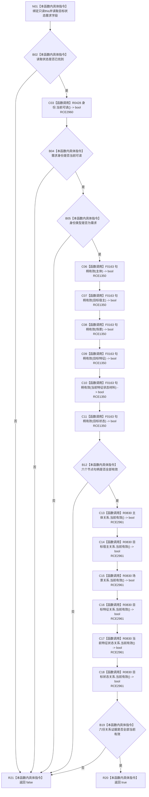

# CF-L9-0066 需求权威材料完整目标状态需求现状流程图

图类型：现状流程图
代码版本：`3920a74638264f9f539d50f32f3c9fe5fb1982ab`
源码 blob：`16ac9534baeda26ac8a712066e713f3339f6e0c8`
覆盖文件：`海中鱼巣/领域/数据操作.需求任务方法.ixx:189-198`
唯一根函数：R0434
完整签名：`bool 海中鱼巣::需求权威材料::完整目标状态需求() const noexcept`
参数：无显式参数；隐式 `this` 为只读借用
返回结果：读取状态、需求身份、六个节点句柄及六份关系证据全部符合当前结构条件时返回 true，否则返回 false
已登记调用方：R0233、R0237、R0459（RCE0805、RCE0818、RCE1424）
直接项目函数：R0428（RCE2960）、F0163（校正后的 RCE1350）、R0830（RCE2961）
外部边界：无
逐行映射表：`流程图/代码流程图/L9/CF-L9-0066_需求权威材料完整目标状态需求_逐行代码映射表.md`
结构读取与写入：只读需求权威材料的身份、节点和关系证据字段；不回读仓库
逻辑内返回：候选需求材料不完整时返回 false
内部错误边界：上游已保证完整目标状态需求后仍返回 false 时追查身份、节点或关系证据来源
依据提交 / 结构化消息：当前维护基线 `7951b1bea78c7338643ab18428180d521e4d5a62`；冻结源码提交 `3920a74638264f9f539d50f32f3c9fe5fb1982ab`
不得作为施工许可：是
不得宣称：返回 true 表示需求节点、关系或状态仍是仓库当前事实

## 流程图

## 当前边界

- 原 RCE1350 把第 191—194 行六个节点句柄检查误绑到关系句柄重载 F0168；本批沿用 RCE1350 校正为 F0163。
- R0428 身份读取与 R0830 六份关系证据读取均是既有聚合缺边，本批分别新增 RCE2960、RCE2961。
- R0830/R0831 是本批直接闭包新增身份；R0830 只组合 R0831 的结构完整性与记录状态有效枚举。
