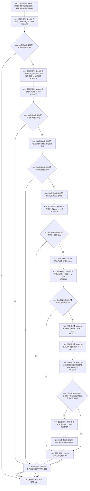

# CF-L9-0067 创建完整目标状态需求结构写入 lambda 现状流程图

图类型：现状流程图
代码版本：`3920a74638264f9f539d50f32f3c9fe5fb1982ab`
源码 blob：`16ac9534baeda26ac8a712066e713f3339f6e0c8`
当前工作区复核基线：`57866ac5ca63235ed12da60f635d29f1aacd718b`
覆盖文件：`海中鱼巣/领域/数据操作.需求任务方法.ixx:2892-2916`
唯一根函数：R0455
完整签名：`void 海中鱼巣::需求任务方法数据操作::创建完整目标状态需求_实现(const 完整需求写入规格& 规格, 固定故障控制* 故障) const::<lambda@数据操作.需求任务方法.ixx:2892>::operator()(海中鱼巣::结构写入会话& 会话) const`
参数：`会话` 为可变借用；按引用捕获外层 `规格`、`新需求`，专项宏启用时捕获 `故障`
返回结果：`void`；任一前置或写入失败直接返回，不请求提交；全部读回条件成立时请求提交
已登记调用方：R0116（RCE0563；回调登记 RCB0020）
直接项目函数：R0458（RCE1406）、R0403（RCE1407）、R0401（RCE1408）、R0451（RCE1409）、R0453（RCE1410）、R0036（RCE1411）、R0037（RCE1412）、R0638（RCE2169）、R0041（RCE1414）
删除项目边：RCE1413（误把双实参 `主键绑定匹配` 绑定到单请求参数重载 R0040）
外部边界：X04254—X04255
逐行映射表：`流程图/代码流程图/L9/CF-L9-0067_创建完整目标状态需求结构写入lambda_逐行代码映射表.md`
结构读写：在同一结构写入会话中检查端点、写目标状态、写需求身份、写需求关系组，读回主信息、节点和主键绑定后请求提交
逻辑内返回：端点不匹配或专项故障注入命中时直接返回
内部错误边界：状态、身份、关系或读回任一步失败时不请求提交，由执行器撤销候选
依据提交 / 结构化消息：当前维护基线 `57866ac5ca63235ed12da60f635d29f1aacd718b`；冻结源码提交 `3920a74638264f9f539d50f32f3c9fe5fb1982ab`
不得作为施工许可：是
不得宣称：请求提交表示执行器最终已提交或需求已经普通可读

## 流程图

## 当前边界

- 当前 Debug|x64 维护配置未启用 `HY_EGO_ENABLE_STRUCTURE_COMMIT_FAULT_SELF_TEST`；N07/B08 仅记录源码条件分支，不登记当前配置不可达的项目调用。
- 第 2915 行双实参调用唯一绑定 R0638；RCE1413 的 R0040 单请求参数重载边应删除。
