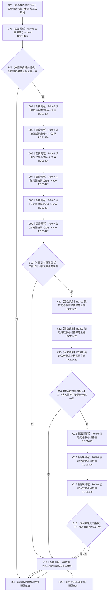

# CF-L9-0068 方法根匹配现状流程图

图类型：现状流程图
代码版本：`3920a74638264f9f539d50f32f3c9fe5fb1982ab`
源码 blob：`16ac9534baeda26ac8a712066e713f3339f6e0c8`
当前工作区复核基线：`57866ac5ca63235ed12da60f635d29f1aacd718b`
覆盖文件：`海中鱼巣/领域/数据操作.需求任务方法.ixx:3465-3479`
唯一根函数：R0460
完整签名：`bool 海中鱼巣::需求任务方法数据操作::方法根匹配(const 方法登记根材料& 当前, const 方法登记根写入规格& 规格) const`
参数：`当前`、`规格` 均为只读借用
返回结果：当前根材料完整且主键、三个抽象状态的幂等主键与状态值均匹配时返回 `true`，否则返回 `false`
已登记调用方：R0432（RCE1339）
直接项目函数：R0456（RCE1425）、R0402（RCE1426）、R0407（RCE1427）、R0399（RCE1428）、R0400（RCE1429）
外部边界：X04264（三份局部状态值式材料生命周期）
逐行映射表：`流程图/代码流程图/L9/CF-L9-0068_方法根匹配_逐行代码映射表.md`
结构读写：读取当前方法根材料及三个当前状态材料；不写机器结构
依据提交 / 结构化消息：当前维护基线 `57866ac5ca63235ed12da60f635d29f1aacd718b`；冻结源码提交 `3920a74638264f9f539d50f32f3c9fe5fb1982ab`
不得作为施工许可：是
不得宣称：匹配成功表示三个状态在后续事务中保持不变

## 流程图

## 当前边界

- 三组同类调用分别共用 RCE1426、RCE1427、RCE1428、RCE1429，并在边对象中冻结逐调用实参。
- 本函数先读取三份状态材料，再执行短路合取比较。
