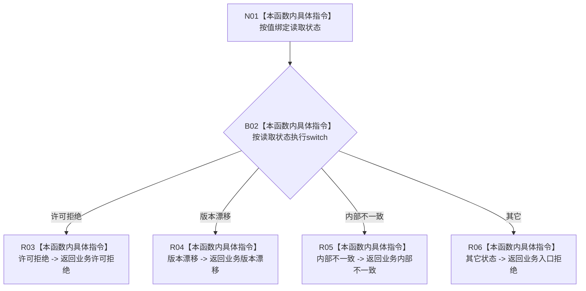

# CF-L9-0069 映射读取失败现状流程图

图类型：现状流程图
代码版本：`3920a74638264f9f539d50f32f3c9fe5fb1982ab`
源码 blob：`16ac9534baeda26ac8a712066e713f3339f6e0c8`
当前工作区复核基线：`57866ac5ca63235ed12da60f635d29f1aacd718b`
覆盖文件：`海中鱼巣/领域/数据操作.需求任务方法.ixx:3537-3544`
唯一根函数：R0461
完整签名：`static 需求任务方法业务状态 海中鱼巣::需求任务方法数据操作::映射读取失败(需求任务方法读取状态 状态) noexcept`
参数：`状态` 按值传入
返回结果：许可拒绝、版本漂移、内部不一致分别映射为同名业务状态；其它读取状态映射为入口拒绝
已登记调用方：R0432、R0463（RCE1340、RCE1430）
直接项目函数：无
外部边界：无
逐行映射表：`流程图/代码流程图/L9/CF-L9-0069_映射读取失败_逐行代码映射表.md`
结构读写：只读取枚举形参并返回另一枚举；无结构变化
依据提交 / 结构化消息：当前维护基线 `57866ac5ca63235ed12da60f635d29f1aacd718b`；冻结源码提交 `3920a74638264f9f539d50f32f3c9fe5fb1982ab`
不得作为施工许可：是
不得宣称：映射结果表示读取失败根因已经解决

## 流程图

## 当前边界

- `已找到`、`未找到`、`入口拒绝`、`类型不匹配` 等未具名 case 均进入 default 并映射为业务入口拒绝。
