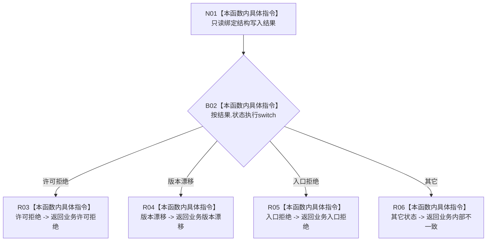

# CF-L9-0070 映射结构失败现状流程图

图类型：现状流程图
代码版本：`3920a74638264f9f539d50f32f3c9fe5fb1982ab`
源码 blob：`16ac9534baeda26ac8a712066e713f3339f6e0c8`
当前工作区复核基线：`af74e46ef3fd0b1b2c108d695569855909a59ee1`
覆盖文件：`海中鱼巣/领域/数据操作.需求任务方法.ixx:3581-3588`
唯一根函数：R0462
完整签名：`static 需求任务方法业务状态 海中鱼巣::需求任务方法数据操作::映射结构失败(const 结构写入结果& 结果) noexcept`
参数：`结果` 为只读借用
返回结果：许可拒绝、版本漂移、入口拒绝分别映射为同名业务状态；其它结构状态映射为内部不一致
已登记调用方：R0432、R0464（RCE1342、RCE1431）
直接项目函数：无
外部边界：无
逐行映射表：`流程图/代码流程图/L9/CF-L9-0070_映射结构失败_逐行代码映射表.md`
结构读写：只读取结构结果状态；无结构变化
依据提交 / 结构化消息：当前维护基线 `57866ac5ca63235ed12da60f635d29f1aacd718b`；冻结源码提交 `3920a74638264f9f539d50f32f3c9fe5fb1982ab`
不得作为施工许可：是
不得宣称：内部不一致返回表示结构失败原因已经定位

## 流程图

## 当前边界

- `未提交`、`已提交` 等不属于失败枚举的状态进入 default 并映射为内部不一致。
