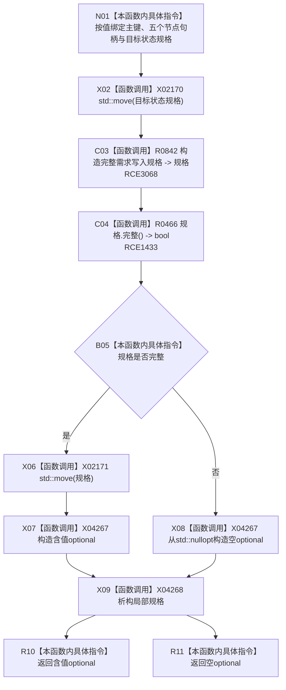

# CF-L9-0071 形成完整需求写入规格现状流程图

图类型：现状流程图
代码版本：`3920a74638264f9f539d50f32f3c9fe5fb1982ab`
源码 blob：`16ac9534baeda26ac8a712066e713f3339f6e0c8`
当前工作区复核基线：`af74e46ef3fd0b1b2c108d695569855909a59ee1`
覆盖文件：`海中鱼巣/领域/数据操作.需求任务方法.ixx:882-896`
唯一根函数：R0467
完整签名：`std::optional<完整需求写入规格> 海中鱼巣::需求任务方法数据操作::形成完整需求写入规格(std::uint64_t 需求主键, 节点句柄 主体, 节点句柄 目标宿主, 节点句柄 场景, 节点句柄 目标特征, 节点句柄 当前特征状态材料, 抽象状态写入规格 目标状态规格) const`
参数：需求主键与五个节点句柄按值传入；`目标状态规格` 按值传入并移动到新规格
返回结果：新规格完整时返回含值 optional，否则返回 `std::nullopt`
已登记调用方：R0514（RCE1520）
直接项目函数：R0842（RCE3068）、R0466（校正后的 RCE1433）
外部边界：X02170、X02171、X04267—X04268
逐行映射表：`流程图/代码流程图/L9/CF-L9-0071_形成完整需求写入规格_逐行代码映射表.md`
结构读写：只形成局部写入规格 DTO；不访问仓库，不写机器结构
依据提交 / 结构化消息：当前维护基线 `57866ac5ca63235ed12da60f635d29f1aacd718b`；冻结源码提交 `3920a74638264f9f539d50f32f3c9fe5fb1982ab`
不得作为施工许可：是
不得宣称：返回含值 optional 表示需求已经写入或规格已经通过领域服务准入

## 流程图

## 当前边界

- 原 RCE1433 误绑 R0329；调用接收者静态类型为 `完整需求写入规格`，本批校正为 R0466。
- R0842 是本批补入的私有项目构造函数身份；其内部 `std::move` 另记 X04251，本批不为 R0842 制图。
