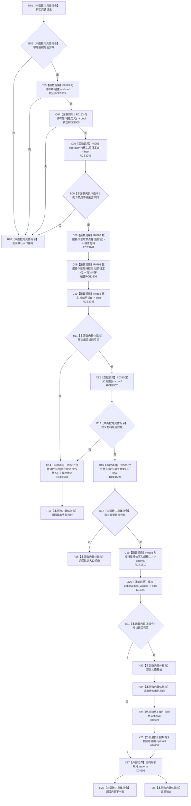

# CF-L9-0072 特征业务服务形成实例特征槽位规格现状流程图

图类型：现状流程图
代码版本：`0a93526882cb33c61c2fbb04ecad1aeaddcfe225`
当前工作区复核基线：`c3939fcd2fe13b6a5ba69e5dcad6efc519bdf667`
源码 blob：`7620a4c6316130cd8af546d69b9528fc696db5c3`
覆盖文件：`海中鱼巣/领域/服务.特征.ixx:116-133`
唯一根函数：R0502
完整签名：`特征槽位规格结果 海中鱼巣::特征业务服务::形成实例特征槽位规格(const 创建实例特征槽位请求& 请求) const`
参数：`请求` 为调用期只读借用
返回结果：入口拒绝、读取失败映射、内部不一致或已形成且含规格的结果
已登记调用方：R0566（RCE1570）
直接项目函数：F0163、F0051、R0383、R0798、R0388、R0390、R0507、R0505、R0381；F0051/R0383/R0388 分别登记为 RCE3246/RCE3247/RCE3248
外部边界：X04598—X04601（规格 optional 查询、解引用、赋值和析构）
逐行映射表：`流程图/代码流程图/L9/CF-L9-0072_特征业务服务形成实例特征槽位规格_逐行代码映射表.md`
不得作为施工许可：是
不得宣称：规格已形成等于槽位已经提交

## 流程图

## 关键边界

- 所有拒绝和读取失败发生在规格形成前，零结构写入。
- RCE1505/RCE1506 分别需按节点句柄静态类型和 `数据操作_` 静态接收者校正为 F0163/R0798。
