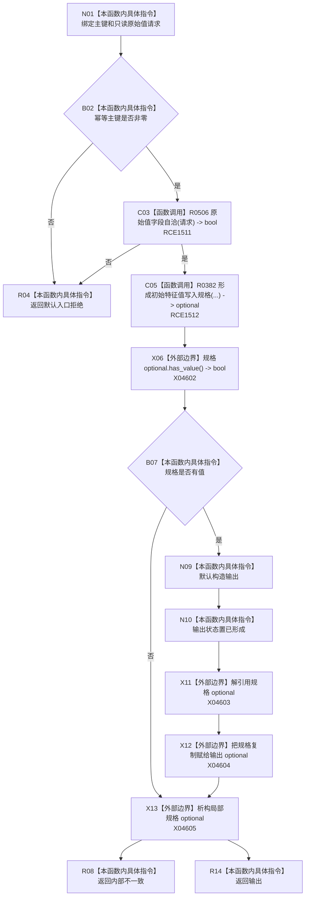

# CF-L9-0073 特征业务服务形成初始特征值规格现状流程图

图类型：现状流程图
代码版本：`0a93526882cb33c61c2fbb04ecad1aeaddcfe225`
当前工作区复核基线：`c3939fcd2fe13b6a5ba69e5dcad6efc519bdf667`
源码 blob：`7620a4c6316130cd8af546d69b9528fc696db5c3`
覆盖文件：`海中鱼巣/领域/服务.特征.ixx:135-147`
唯一根函数：R0503
完整签名：`初始特征值规格结果 海中鱼巣::特征业务服务::形成初始特征值规格(std::uint64_t 特征值幂等主键, const 初始特征原始值请求& 请求) const`
参数：主键值传入；请求只读借用
返回结果：入口拒绝、内部不一致或已形成且含初始值规格的结果
直接项目函数：R0506（RCE1511）、R0382（RCE1512）
外部边界：X04602—X04605（规格 optional 查询、解引用、赋值和析构）
逐行映射表：`流程图/代码流程图/L9/CF-L9-0073_特征业务服务形成初始特征值规格_逐行代码映射表.md`
不得作为施工许可：是
不得宣称：规格已形成等于初始特征状态已经发布

## 流程图

## 关键边界

- 本函数仅形成值式写入规格，不提交任何节点或关系。
