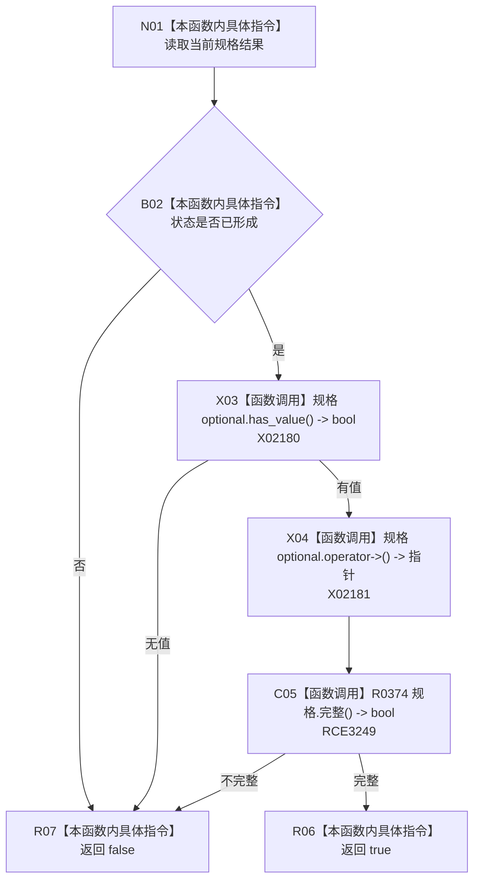

# CF-L9-0074 特征槽位规格结果成功现状流程图

图类型：现状流程图
代码版本：`0a93526882cb33c61c2fbb04ecad1aeaddcfe225`
当前工作区复核基线：`c3939fcd2fe13b6a5ba69e5dcad6efc519bdf667`
源码 blob：`7620a4c6316130cd8af546d69b9528fc696db5c3`
覆盖文件：`海中鱼巣/领域/服务.特征.ixx:84-86`
唯一根函数：R0508
完整签名：`bool 海中鱼巣::特征槽位规格结果::成功() const noexcept`
参数：无显式参数；只读使用当前结果对象
返回结果：状态为已形成、规格有值且规格完整时返回 true，否则按短路顺序返回 false
已登记调用方：R0566（RCE1571）
直接项目函数：R0374（RCE3249）
外部边界：X02180、X02181
逐行映射表：`流程图/代码流程图/L9/CF-L9-0074_特征槽位规格结果成功_逐行代码映射表.md`
不得作为施工许可：是
不得宣称：成功判定等于规格已经提交

## 流程图

## 关键边界

- `&&` 按源码短路：状态不成立时不访问 optional，无值时不解引用，也不调用 R0374。
