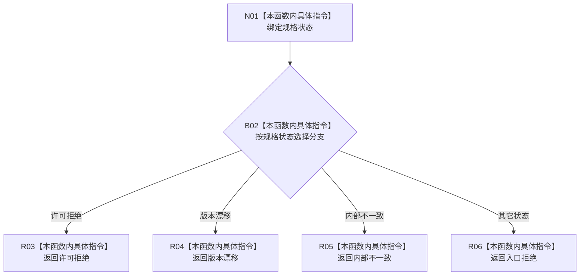

# CF-L9-0076 需求业务服务映射规格失败现状流程图

图类型：现状流程图
代码版本：`0a93526882cb33c61c2fbb04ecad1aeaddcfe225`
当前工作区复核基线：`c3939fcd2fe13b6a5ba69e5dcad6efc519bdf667`
源码 blob：`c56f9fc6c725e59a2d57cd5557326c5887384b4f`
覆盖文件：`海中鱼巣/领域/服务.需求.ixx:303-314`
唯一根函数：R0513
完整签名：`static 需求任务方法业务状态 海中鱼巣::需求业务服务::映射规格失败(状态写入规格状态 状态) noexcept`
参数：状态写入规格状态枚举值传入
返回结果：许可拒绝、版本漂移、内部不一致保持同类语义，其它状态映射为入口拒绝
已登记调用方：R0514（RCE1519）
直接项目函数：无
逐行映射表：`流程图/代码流程图/L9/CF-L9-0076_需求业务服务映射规格失败_逐行代码映射表.md`
不得作为施工许可：是
不得宣称：映射后的状态已经执行任何补偿或结构变更

## 流程图

## 关键边界

- 本函数为纯枚举映射，无结构读取或写入。
