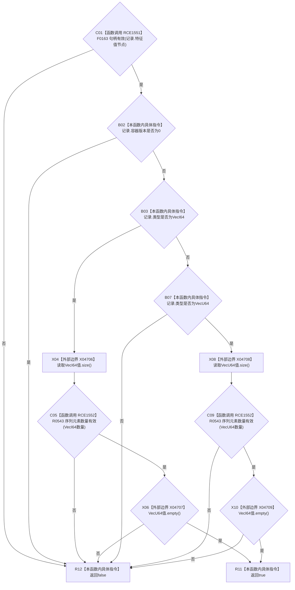

# CF-L9-0077 Vec记录内部一致现状流程图

图类型：现状流程图
代码版本：`0a93526882cb33c61c2fbb04ecad1aeaddcfe225`
工作区复核基线：`2089268fbb3833ebc77486169b98d8a14c49d508`
源码 blob：`be8c82c78253b3bc7d3f4aa15a93660e0025bb06`
覆盖文件：`海中鱼巣/领域/特征值服务.h:580-591`
唯一根函数：R0544
完整签名：`static bool 海中鱼巣::特征值服务::Vec记录内部一致(const Vec原始值记录& 记录)`
参数：`记录` 以 const 引用借用，只读节点句柄、类型、两个序列和容器版本
返回结果：节点句柄有效、容器版本非零，且与 VecI64 或 VecU64 类型对应的唯一序列数量有效而另一序列为空时返回 `true`；否则返回 `false`
已登记调用方：R0266（RCE0883）、R0732（RCE2255）
直接项目函数：F0163 节点句柄重载（RCE1551）、R0543（RCE1552）
外部边界：X04706—X04709
逐行映射表：`流程图/代码流程图/L9/CF-L9-0077_Vec记录内部一致_逐行代码映射表.md`
结构读写：只读 Vec 原始值记录，不修改记录或服务侧表
不得作为施工许可：是
不得宣称：记录内部一致代表节点仍存在、主信息有效或同节点不存在重复记录

## 流程图

## 当前边界

- 行 581 的实参静态类型为 `节点句柄`；RCE1551 指向精确重载 F0163。
- 两个类型分支都按 `&&` 短路：本类型序列数量无效时不会读取另一类型序列的 `empty()`。
