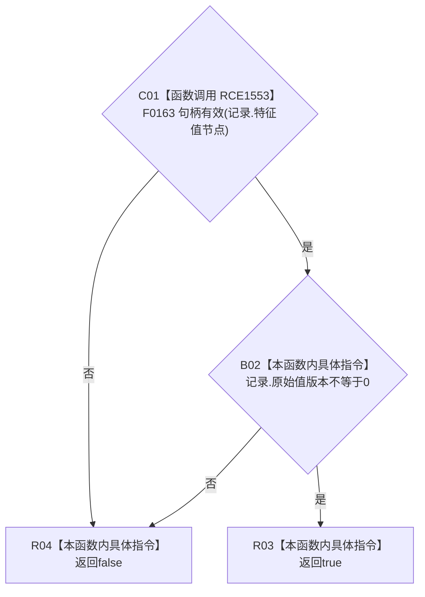

# CF-L9-0078 I64版本记录内部一致现状流程图

图类型：现状流程图
代码版本：`0a93526882cb33c61c2fbb04ecad1aeaddcfe225`
工作区复核基线：`2089268fbb3833ebc77486169b98d8a14c49d508`
源码 blob：`be8c82c78253b3bc7d3f4aa15a93660e0025bb06`
覆盖文件：`海中鱼巣/领域/特征值服务.h:593-595`
唯一根函数：R0545
完整签名：`static bool 海中鱼巣::特征值服务::I64版本记录内部一致(const I64版本记录& 记录)`
参数：`记录` 以 const 引用借用，只读特征值节点句柄和原始值版本
返回结果：节点句柄有效且原始值版本非零时返回 `true`，否则返回 `false`
已登记调用方：R0266（RCE0881）、R0732（RCE2256）
直接项目函数：F0163 节点句柄重载（RCE1553）
外部边界：无
逐行映射表：`流程图/代码流程图/L9/CF-L9-0078_I64版本记录内部一致_逐行代码映射表.md`
结构读写：只读 I64 版本记录，不修改记录或服务侧表
不得作为施工许可：是
不得宣称：记录内部一致代表主信息中必有 I64 值或不存在重复版本记录

## 流程图

## 当前边界

- 行 594 的实参静态类型为 `节点句柄`；RCE1553 指向精确重载 F0163。
- `&&` 按从左到右短路；节点句柄无效时不再检查版本字段。
