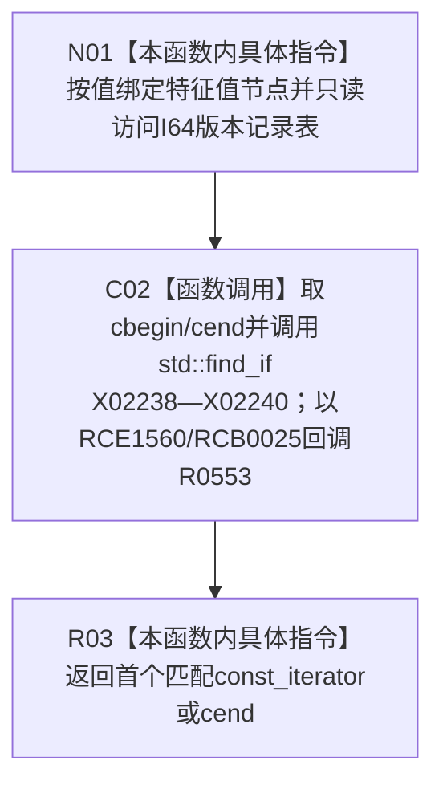

# CF-L9-0081 查找I64版本记录已加锁只读重载现状流程图

图类型：现状流程图
代码版本：`0a93526882cb33c61c2fbb04ecad1aeaddcfe225`
工作区复核基线：`03a8b7ac099ccea83e57f2696e2290b7bcdfacaf`
源码 blob：`be8c82c78253b3bc7d3f4aa15a93660e0025bb06`
覆盖文件：`海中鱼巣/领域/特征值服务.h:691-695`
唯一根函数：R0552
完整签名：`std::vector<I64版本记录>::const_iterator 海中鱼巣::特征值服务::查找I64版本记录_已加锁(节点句柄 特征值节点) const`
参数：`特征值节点` 按值输入；`this` 为 const；函数名要求调用方已持有适当锁，函数体不自行验证锁状态
返回结果：返回首个节点句柄匹配的只读 I64 版本记录迭代器；无匹配时返回 `I64版本记录表_.cend()`
已登记调用方：R0266（RCE0880）、R0732（RCE2254）
直接项目函数：R0553（RCE1560；由 RCB0025 在 `std::find_if` 内零到多次回调）
外部边界：X02238—X02240
逐行映射表：`流程图/代码流程图/L9/CF-L9-0081_查找I64版本记录已加锁只读重载_逐行代码映射表.md`
结构读写：只读 I64 版本记录表并返回 const 迭代器
不得作为施工许可：是
不得宣称：返回迭代器在锁释放或容器修改后仍有效

## 流程图

## 当前边界

- `std::find_if` 的区间与算法调用属于 R0552；lambda 正文由 R0553 独立覆盖。
- const 重载不提供可写记录访问，但仍依赖调用方维持容器和锁生命周期。
