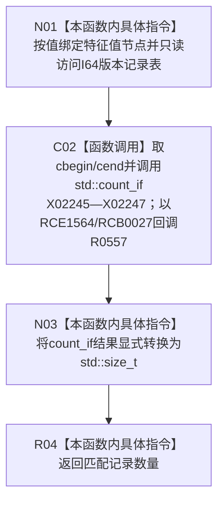

# CF-L9-0083 计算I64版本记录数量已加锁现状流程图

图类型：现状流程图
代码版本：`0a93526882cb33c61c2fbb04ecad1aeaddcfe225`
工作区复核基线：`03a8b7ac099ccea83e57f2696e2290b7bcdfacaf`
源码 blob：`be8c82c78253b3bc7d3f4aa15a93660e0025bb06`
覆盖文件：`海中鱼巣/领域/特征值服务.h:704-709`
唯一根函数：R0556
完整签名：`std::size_t 海中鱼巣::特征值服务::计算I64版本记录数量_已加锁(节点句柄 特征值节点) const`
参数：`特征值节点` 按值输入；`this` 为 const；函数名要求调用方已持有适当锁，函数体不自行验证锁状态
返回结果：返回 I64 版本记录表中节点句柄匹配的记录数量，并显式转换为 `std::size_t`
已登记调用方：R0260（RCE0872）、R0266（RCE0879）、R0732（RCE2251）
直接项目函数：R0557（RCE1564；由 RCB0027 在 `std::count_if` 内按记录回调）
外部边界：X02245—X02247
逐行映射表：`流程图/代码流程图/L9/CF-L9-0083_计算I64版本记录数量已加锁_逐行代码映射表.md`
结构读写：只读 I64 版本记录表，不修改记录或索引
不得作为施工许可：是
不得宣称：计数结果代表记录内部一致、节点有效或版本历史连续

## 流程图

## 当前边界

- `std::count_if` 的区间与算法调用属于 R0556；lambda 正文由 R0557 独立覆盖。
- 本函数只计数节点句柄匹配项，不检查版本值、版本号或事务归属。
