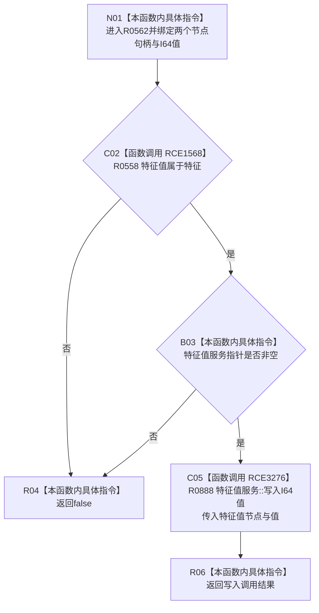

# CF-L9-0084 特征服务写入I64特征值现状流程图

图类型：现状流程图
代码版本：`0a93526882cb33c61c2fbb04ecad1aeaddcfe225`
工作区复核基线：`03a8b7ac099ccea83e57f2696e2290b7bcdfacaf`
源码 blob：`4c7bcd451f2e46e85d707a40c371dcbeaa2c1169`
覆盖文件：`海中鱼巣/领域/特征服务.h:356-361`
唯一根函数：R0562
完整签名：`bool 海中鱼巣::特征服务::写入I64特征值(节点句柄 特征节点, 节点句柄 特征值节点, std::int64_t 值)`
参数：两个节点句柄与 I64 值均按值输入；隐式 `this` 为非拥有借用
返回结果：归属成立且特征值服务存在时返回 `特征值服务::写入I64值` 的结果，否则返回 `false`
已登记调用方：R0249（RCE0842）
直接项目函数：R0558（RCE1568）；R0888（RCE3276）`特征值服务::写入I64值(节点句柄, std::int64_t)`
外部边界：无
逐行映射表：`流程图/代码流程图/L9/CF-L9-0084_特征服务写入I64特征值_逐行代码映射表.md`
结构读写：先只读归属关系，再委托特征值服务写入 I64 原始值
不得作为施工许可：是
不得宣称：返回 `true` 代表特征槽位、当前值关系或业务状态已被原子发布

## 流程图

## 当前边界

- 第 357 行按 `||` 短路；归属不成立时不会读取 `特征值_` 是否为空。
- 本函数不展开被调写入函数的事务许可、加锁、版本递增和写后读回流程。
