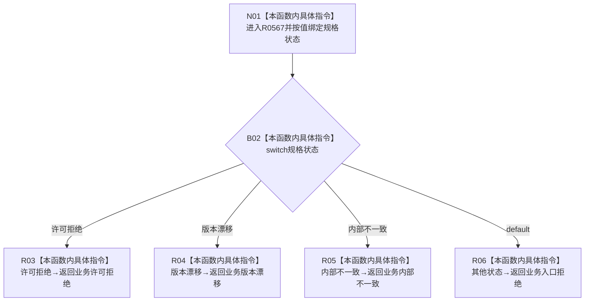

# CF-L9-0085 特征状态组合器映射规格失败现状流程图

图类型：现状流程图
代码版本：`0a93526882cb33c61c2fbb04ecad1aeaddcfe225`
工作区复核基线：`03a8b7ac099ccea83e57f2696e2290b7bcdfacaf`
源码 blob：`e1e70ac49fbfa683a9fbb238f57e123b18d22c01`
覆盖文件：`海中鱼巣/领域/组合.特征状态.ixx:44-55`
唯一根函数：R0567
完整签名：`static 特征体系业务结果 海中鱼巣::特征状态组合器::映射规格失败(特征规格状态 状态) noexcept`
参数：`状态` 按值输入
返回结果：把三种具名规格失败状态映射到同名业务状态，其余状态统一映射为业务入口拒绝
已登记调用方：R0566（RCE1573；两处调用）
直接项目函数：无
外部边界：无
逐行映射表：`流程图/代码流程图/L9/CF-L9-0085_特征状态组合器映射规格失败_逐行代码映射表.md`
结构读写：无，只构造值式业务结果
不得作为施工许可：是
不得宣称：默认分支仅接收 `入口拒绝`，或映射结果证明任何结构事务已发生

## 流程图

## 当前边界

- `已形成`、`入口拒绝` 以及未来新增但未显式列举的枚举值都会进入默认分支。
- 函数声明为 `noexcept`，且只构造不含资源所有权的值式结果。
