# CF-L9-0086 需求服务创建自我目标状态需求现状流程图

图类型：现状流程图
代码版本：`03a8b7ac099ccea83e57f2696e2290b7bcdfacaf`
工作区复核基线：`7edb47f7b58aa71a10c225790e41f1d6c12a0cbd`
源码 blob：`e41b0c665b360232e55ede728f2a4d561c5c9d32`
覆盖文件：`海中鱼巣/领域/需求服务.h:292-343`
唯一根函数：R0579
完整签名：`节点句柄 海中鱼巣::需求服务::创建自我目标状态需求(节点句柄 自我存在, 节点句柄 需求场景, 节点句柄 目标特征, 特征服务& 特征, 节点句柄 当前特征值, 状态服务& 状态, std::int64_t 目标状态值)`
参数：四个句柄和目标状态值按值传入；`特征`、`状态` 为调用期间有效的非拥有可变借用；隐式 `this` 为非拥有借用
返回结果：入口材料、既有特征值、创建、关系写入或读回任一步未满足时返回空句柄；全部通过时返回新需求节点
已登记调用方：R0249（RCE0843）
直接项目函数：R0729（RCE2225，三处）、F0554（RCE1597）、F0555（RCE1598）、F0165（RCE3314）、F0163（RCE3315）、F0184（RCE1600）、R0578（RCE1601）、F0167（RCE3316）、F0168（RCE1599，六处关系句柄）、F0552（RCE1602）、F0553（RCE1603）、R0585（RCE1604）
外部边界：X04781—X04783（入口 optional 读取）；X04784—X04787（承接材料 optional 读取、临时 optional 构造与相等比较）
逐行映射表：`流程图/代码流程图/L9/CF-L9-0086_需求服务创建自我目标状态需求_逐行代码映射表.md`
结构读写：创建目标状态、需求节点和六条承接关系；随后只读回主体、目标宿主、场景、目标状态、目标特征与当前特征值材料
逻辑内返回：入口三类节点不匹配，或实例特征槽位 / 当前特征值材料缺失
内部错误：目标状态或需求节点创建无效、六条关系任一无效、承接材料读回不完整均经 F0184 登记后返回空句柄
生命周期与资源释放：optional、节点句柄、关系句柄和读回材料均为局部值；本函数无显式撤销
不得作为施工许可：是
不得宣称：空句柄分支已经撤销此前写入、返回有效句柄等于完整需求已发布，或多仓库写入具备原子性

## 流程图

```mermaid
flowchart TD
    N01["N01【本函数内具体指令】进入R0579并绑定七个显式参数与this"]
    C02["C02【函数调用 RCE2225】R0729 判断自我存在类型"]
    B03{"B03【本函数内具体指令】自我存在是否为存在类型"}
    C04["C04【函数调用 RCE2225】R0729 判断需求场景类型"]
    B05{"B05【本函数内具体指令】需求场景是否为场景类型"}
    C06["C06【函数调用 RCE2225】R0729 判断目标特征类型"]
    B07{"B07【本函数内具体指令】目标特征是否为特征类型"}
    R08["R08【本函数内具体指令】返回空节点句柄"]
    C09["C09【函数调用 RCE1597】F0554 读取宿主特征槽位→实例特征槽位"]
    X10["X10【函数调用·外部边界 X04781—X04783】检查槽位并读取槽位与当前值"]
    C11["C11【函数调用 RCE1598】F0555 读取I64特征值→当前值结果"]
    B12{"B12【本函数内具体指令】槽位与当前值是否都存在"}
    C13["C13【函数调用 RCE3314】F0165 状态服务::创建抽象状态(目标状态值)→目标状态"]
    C14["C14【函数调用 RCE3315】F0163 句柄有效(目标状态)→句柄有效"]
    C15["C15【函数调用 RCE1600】F0184 追根因检查目标状态创建结果"]
    B16{"B16【本函数内具体指令】目标状态创建是否符合预期"}
    C17["C17【函数调用 RCE1601】R0578 创建需求()→需求节点"]
    C18["C18【函数调用 RCE3315】F0163 句柄有效(需求节点)→句柄有效"]
    C19["C19【函数调用 RCE1600】F0184 追根因检查需求节点创建结果"]
    B20{"B20【本函数内具体指令】需求节点创建是否符合预期"}
    C21["C21【函数调用 RCE3316】F0167 六次创建主体、目标宿主、场景、特征、当前值与目标状态关系"]
    C22["C22【函数调用 RCE1599】F0168 六次检查关系句柄有效"]
    C23["C23【函数调用 RCE1600】F0184 追根因检查六条关系写入结果"]
    B24{"B24【本函数内具体指令】六条关系是否全部有效"}
    C25["C25【函数调用 RCE1602】F0552 读取需求承接材料→承接材料"]
    X26["X26【函数调用·外部边界 X04784—X04787】检查承接材料并比较六项读回"]
    C27["C27【函数调用 RCE1603】F0553 读取需求目标特征→目标特征读回"]
    C28["C28【函数调用 RCE1604】R0585 读取需求当前特征状态材料→当前值读回"]
    N29["N29【本函数内具体指令】短路比较六项读回并形成完整读回bool"]
    C30["C30【函数调用 RCE1600】F0184 追根因检查完整读回"]
    B31{"B31【本函数内具体指令】完整读回是否符合预期"}
    R32["R32【本函数内具体指令】按值返回需求节点"]

    N01 --> C02 --> B03
    B03 -- "否" --> R08
    B03 -- "是" --> C04 --> B05
    B05 -- "否" --> R08
    B05 -- "是" --> C06 --> B07
    B07 -- "否" --> R08
    B07 -- "是" --> C09 --> X10 --> C11 --> B12
    B12 -- "否" --> R08
    B12 -- "是" --> C13 --> C14 --> C15 --> B16
    B16 -- "否" --> R08
    B16 -- "是" --> C17 --> C18 --> C19 --> B20
    B20 -- "否" --> R08
    B20 -- "是" --> C21 --> C22 --> C23 --> B24
    B24 -- "否" --> R08
    B24 -- "是" --> C25 --> X26 --> C27 --> C28 --> N29 --> C30 --> B31
    B31 -- "否" --> R08
    B31 -- "是" --> R32
```

## 当前边界

- 第 295—297 行按 `||` 从左到右短路；任何入口类型不符都发生在持久写入前。
- 第 302 行只在槽位 optional 有值时读取槽位并查询当前特征值；当前值缺失也发生在持久写入前。
- 第 306—320 行先后创建目标状态、需求节点和六条关系；其后失败分支没有显式撤销，图不把空句柄返回写成结构回滚。
- 第 332—338 行按 `&&` 从左到右短路读回；只有前序比较成立时才调用后续读取函数。
