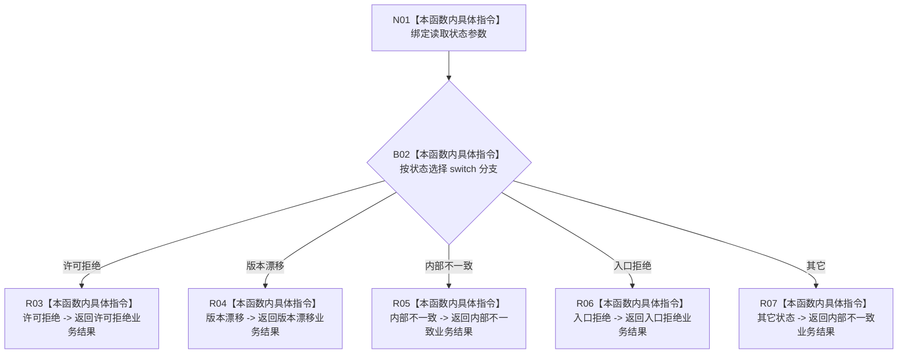

# CF-L9-0087 从读取失败形成结果现状流程图

图类型：现状流程图
代码版本：`03a8b7ac099ccea83e57f2696e2290b7bcdfacaf`
当前工作区复核基线：`7cbd2167eb5f6d495f48657a0e5badb07c52a358`
源码 blob：`524922ab2f3d0d76cfed4bdd517f0d7d57e1ae6a`
覆盖文件：`海中鱼巣/领域/数据操作.存在场景.ixx:503-516`
唯一根函数：R0629
完整签名：`海中鱼巣::存在场景业务结果 海中鱼巣::存在场景数据操作::从读取失败形成结果(海中鱼巣::存在场景读取状态 状态) noexcept`
参数：`状态` 按值输入
返回结果：许可拒绝、版本漂移、内部不一致、入口拒绝分别映射为同名业务状态；其它状态映射为内部不一致
调用图：`流程图/主程序可达调用关系/01_main可达项目调用边表.md`
输入契约 / 调用语境表：本图“当前边界”节；未另建独立表
非成功返回二分审查表：本图返回节点与“当前边界”节；未另建独立表
偏差清单：无 / 不适用；本图只登记当前实现事实
依据提交 / 结构化消息：源码冻结 `03a8b7ac099ccea83e57f2696e2290b7bcdfacaf`；无结构化执行消息
验证输出：配对逐行映射、节点集合、源码 blob 与本批机械审计
已登记调用方：R0627、R0633、R0650、R0651、R0652（RCE1803、RCE1820、RCE1911、RCE1917、RCE1930）
直接项目函数：无
外部边界：无
逐行映射表：`流程图/代码流程图/L9/CF-L9-0087_从读取失败形成结果_逐行代码映射表.md`
结构读写：只读值参数并返回值式结果，不修改结构
不得作为施工许可：是
不得宣称：未列出的读取状态属于正常业务返回

## 流程图

## 当前边界

- `未找到`、`已找到` 等不应作为读取失败传入的状态统一落入默认内部不一致结果。
