# CF-L9-0088 读取节点身份已许可现状流程图

图类型：现状流程图
代码版本：`03a8b7ac099ccea83e57f2696e2290b7bcdfacaf`
当前工作区复核基线：`7cbd2167eb5f6d495f48657a0e5badb07c52a358`
源码 blob：`524922ab2f3d0d76cfed4bdd517f0d7d57e1ae6a`
覆盖文件：`海中鱼巣/领域/数据操作.存在场景.ixx:443-481`
唯一根函数：R0630
完整签名：`海中鱼巣::节点身份材料 海中鱼巣::存在场景数据操作::读取节点身份_已许可(海中鱼巣::节点句柄 节点, const 海中鱼巣::结构事务令牌& 令牌) const`
参数：`节点` 按值输入；`令牌` 以 const 引用输入并由调用方保持有效
返回结果：无效句柄返回默认材料；节点缺失返回版本漂移；主信息、来源节点、来源唯一性或关系权威读回不一致时经 R0631 返回内部不一致；非存在节点返回基本身份；存在节点返回补齐虚拟来源与关系的身份
调用图：`流程图/主程序可达调用关系/01_main可达项目调用边表.md`
输入契约 / 调用语境表：本图“当前边界”节；未另建独立表
非成功返回二分审查表：本图返回节点与“当前边界”节；未另建独立表
偏差清单：无 / 不适用；本图只登记当前实现事实
依据提交 / 结构化消息：源码冻结 `03a8b7ac099ccea83e57f2696e2290b7bcdfacaf`；无结构化执行消息
验证输出：配对逐行映射、节点集合、源码 blob 与本批机械审计
已登记调用方：R0626、R0648、R0649（RCE1800、RCE1896、RCE1902）
直接项目函数：F0163、F0346、F0439、R0631、R0078、R0632、F0440、F0051（RCE1805—RCE1811、RCE3324）
外部边界：X02350—X02358、X04846—X04848
逐行映射表：`流程图/代码流程图/L9/CF-L9-0088_读取节点身份已许可_逐行代码映射表.md`
结构读写：在既有令牌下只读节点、主信息和关系；只修改局部输出材料
不得作为施工许可：是
不得宣称：基本身份可读即代表存在来源关系完整，或内部一致性已经过运行验证

## 流程图

```mermaid
flowchart TD
    N01["N01【本函数内具体指令】绑定节点与结构事务令牌"]
    C02["C02【函数调用】F0163 句柄有效(节点) -> bool<br/>RCE1805"]
    B03{"B03【本函数内具体指令】节点句柄有效"}
    R04["R04【本函数内具体指令】返回默认空身份材料"]
    C05["C05【函数调用】F0346 读取节点(节点, 令牌) -> optional记录<br/>RCE1806"]
    X06["X06【外部边界 X02350】optional节点记录.has_value() -> bool"]
    B07{"B07【本函数内具体指令】节点记录可读"}
    R08["R08【本函数内具体指令】返回版本漂移身份材料"]
    X09["X09【外部边界 X02351】读取记录的主信息句柄"]
    C10["C10【函数调用】F0439 读取主信息(句柄, 令牌) -> optional记录<br/>RCE1807"]
    X11["X11【外部边界 X02352】optional主信息记录.has_value() -> bool"]
    B12{"B12【本函数内具体指令】主信息锚点可读"}
    C13["C13【函数调用】R0631 返回主信息缺失的内部不一致材料<br/>RCE1808"]
    N14["N14【本函数内具体指令】默认构造局部输出材料"]
    N15["N15【本函数内具体指令】写入已找到状态与节点句柄"]
    X16["X16【外部边界 X02351】读取节点记录类型"]
    N17["N17【本函数内具体指令】写入输出节点类型"]
    B18{"B18【本函数内具体指令】节点类型是否为存在"}
    R19["R19【本函数内具体指令】返回基本身份材料"]
    C20["C20【函数调用】R0078 获取引用关系记录组(节点, 引用, 令牌)<br/>RCE1809"]
    X21["X21【外部边界】取得并推进关系组 const_iterator<br/>X02353、X04846—X04848"]
    B22{"B22【本函数内具体指令】循环中是否还有引用记录"}
    C23["C23【函数调用】F0346 读取引用目标节点(目标, 令牌) -> optional记录<br/>RCE1806"]
    X24["X24【外部边界 X02350】目标节点记录.has_value() -> bool"]
    B25{"B25【本函数内具体指令】来源节点可读"}
    C26["C26【函数调用】R0631 返回来源节点不可读的内部不一致材料<br/>RCE1808"]
    X27["X27【外部边界 X02351】读取来源节点类型"]
    C28["C28【函数调用】R0632 是来源类型(类型) -> bool<br/>RCE1810"]
    B29{"B29【本函数内具体指令】引用目标属于需求、任务或方法"}
    X30["X30【外部边界 X02354】输出.虚拟来源.has_value() -> bool"]
    B31{"B31【本函数内具体指令】已经记录过虚拟来源"}
    C32["C32【函数调用】R0631 返回多个来源的内部不一致材料<br/>RCE1808"]
    N33["N33【本函数内具体指令】由仓库号、关系号和版本构造完整关系句柄"]
    C34["C34【函数调用】F0440 读取关系(完整句柄, 令牌) -> optional记录<br/>RCE1811"]
    X35["X35【外部边界 X02355】optional关系记录.has_value() -> bool"]
    B36{"B36【本函数内具体指令】关系记录存在"}
    X38["X38【外部边界 X02356】读取当前关系类型和两端节点"]
    B39{"B39【本函数内具体指令】当前关系类型为引用"}
    C40["C40【函数调用】F0051 比较当前源节点与节点<br/>RCE3324 第1次"]
    B41{"B41【本函数内具体指令】当前源节点等于节点"}
    C42["C42【函数调用】F0051 比较当前目标节点与引用目标<br/>RCE3324 第2次"]
    B43{"B43【本函数内具体指令】当前目标节点等于引用目标"}
    C44["C44【函数调用】R0631 返回关系权威读回不一致材料<br/>RCE1808"]
    X45["X45【外部边界 X02357】把引用目标写入 optional虚拟来源"]
    X46["X46【外部边界 X02358】把完整句柄写入 optional来源关系"]
    R47["R47【本函数内具体指令】返回完整输出身份材料"]
    N01 --> C02 --> B03
    B03 -- 否 --> R04
    B03 -- 是 --> C05 --> X06 --> B07
    B07 -- 否 --> R08
    B07 -- 是 --> X09 --> C10 --> X11 --> B12
    B12 -- 否 --> C13
    B12 -- 是 --> N14 --> N15 --> X16 --> N17 --> B18
    B18 -- 否 --> R19
    B18 -- 是 --> C20 --> X21 --> B22
    B22 -- 否 --> R47
    B22 -- 是 --> C23 --> X24 --> B25
    B25 -- 否 --> C26
    B25 -- 是 --> X27 --> C28 --> B29
    B29 -- 否 --> X21
    B29 -- 是 --> X30 --> B31
    B31 -- 是 --> C32
    B31 -- 否 --> N33 --> C34 --> X35 --> B36
    B36 -- 否 --> C44
    B36 -- 是 --> X38 --> B39
    B39 -- 否 --> C44
    B39 -- 是 --> C40 --> B41
    B41 -- 否 --> C44
    B41 -- 是 --> C42 --> B43
    B43 -- 否 --> C44
    B43 -- 是 --> X45 --> X46 --> X21
```

## 当前边界

- 非 `存在` 类型只返回节点基本身份，不读取引用关系。
- 引用目标不是需求、任务或方法时被跳过；第二个合法来源、不可读来源或完整关系读回不一致均返回内部不一致材料。
- RCE3324 聚合源码 473、474 两次节点句柄 `!=` 表达式的 `operator==` rewrite，不拆成两个项目边身份。
