# CF-L9-0089 创建身份现状流程图

图类型：现状流程图
代码版本：`03a8b7ac099ccea83e57f2696e2290b7bcdfacaf`
当前工作区复核基线：`7cbd2167eb5f6d495f48657a0e5badb07c52a358`
源码 blob：`524922ab2f3d0d76cfed4bdd517f0d7d57e1ae6a`
覆盖文件：`海中鱼巣/领域/数据操作.存在场景.ixx:619-683`
唯一根函数：R0633
完整签名：`海中鱼巣::存在场景业务结果 海中鱼巣::存在场景数据操作::创建身份(std::uint64_t 主键, 海中鱼巣::节点类型 类型, std::optional<海中鱼巣::节点句柄> 来源) const`
参数：`主键`、`类型` 按值输入；`来源` 按值持有 optional 节点句柄；只允许存在或场景类型，带来源时只允许有效来源句柄与存在类型
返回结果：入口非法返回默认结果；事务提交返回已提交；来源读回漂移返回版本漂移；未提交时按主键身份读回形成幂等读回、幂等冲突、读取失败映射或结构失败映射
调用图：`流程图/主程序可达调用关系/01_main可达项目调用边表.md`
输入契约 / 调用语境表：本图“当前边界”节；未另建独立表
非成功返回二分审查表：本图返回节点与“当前边界”节；未另建独立表
偏差清单：无 / 不适用；本图只登记当前实现事实
依据提交 / 结构化消息：源码冻结 `03a8b7ac099ccea83e57f2696e2290b7bcdfacaf`；无结构化执行消息
验证输出：配对逐行映射、节点集合、源码 blob 与本批机械审计
已登记调用方：R0627、R0650（RCE1804、RCE1912）
直接项目函数：F0442、F0163、R0116、R0626、R0635、R0636、R0629、R0639（RCE1813—RCE1815、RCE1817—RCE1821）
回调边界：RCB0030 注册 R0634；R0116 经 RCE1816 同步调度 R0634，本图不展开 R0634 正文
外部边界：X02359—X02363
逐行映射表：`流程图/代码流程图/L9/CF-L9-0089_创建身份_逐行代码映射表.md`
结构读写：R0116 同步执行独立回调 R0634 尝试写入；根函数只接收结构结果并完成提交后或失败后的业务读回裁决
不得作为施工许可：是
不得宣称：调用 R0116 必然提交，或接口存在等于创建能力已经验收

## 流程图

```mermaid
flowchart TD
    N01["N01【本函数内具体指令】绑定主键、类型和 optional来源"]
    C02["C02【函数调用】F0442 有效() -> bool<br/>RCE1813"]
    B03{"B03【本函数内具体指令】接线有效"}
    B04{"B04【本函数内具体指令】主键非0"}
    B05{"B05【本函数内具体指令】类型为存在或场景"}
    X06["X06【外部边界 X02359】来源.has_value() -> bool"]
    B07{"B07【本函数内具体指令】来源是否有值"}
    B08{"B08【本函数内具体指令】带来源时类型为存在"}
    X09["X09【外部边界 X02360】解引用来源节点"]
    C10["C10【函数调用】F0163 句柄有效(来源) -> bool<br/>RCE1814"]
    B11{"B11【本函数内具体指令】来源句柄有效"}
    R12["R12【本函数内具体指令】返回默认入口拒绝结果"]
    N13["N13【本函数内具体指令】初始化来源版本漂移标记为 false"]
    N14["N14【本函数内具体指令】默认构造新主信息、新节点和新关系句柄"]
    N15["N15【本函数内具体指令】定义捕获局部状态的独立回调 R0634，并经 X02362 包装为 std::function"]
    C16["C16【函数调用】R0116 执行回调并返回结构结果<br/>RCE1815；RCB0030；RCE1816 同步调度 R0634"]
    X17["X17【外部边界 X02363】销毁临时 std::function"]
    N18["N18【本函数内具体指令】绑定结构写入结果"]
    B19{"B19【本函数内具体指令】结构状态为已提交"}
    B20{"B20【本函数内具体指令】创建类型为场景"}
    R21["R21【本函数内具体指令】返回场景已提交结果和新节点"]
    R22["R22【本函数内具体指令】返回存在已提交结果、新节点与新关系"]
    B23{"B23【本函数内具体指令】来源版本已经漂移"}
    R24["R24【本函数内具体指令】返回版本漂移业务结果"]
    C25["C25【函数调用】R0626 读取主键身份(主键) -> 当前身份<br/>RCE1817"]
    B26{"B26【本函数内具体指令】当前身份状态为已找到"}
    B27{"B27【本函数内具体指令】请求和当前身份均为场景"}
    R28["R28【本函数内具体指令】返回场景幂等读回"]
    X29["X29【外部边界 X02359】来源.has_value() -> bool"]
    B30{"B30【本函数内具体指令】来源无值"}
    C31["C31【函数调用】R0635 是实际存在(当前身份) -> bool<br/>RCE1818"]
    B32{"B32【本函数内具体指令】当前身份为实际存在"}
    R33["R33【本函数内具体指令】返回实际存在幂等读回"]
    X34["X34【外部边界 X02359】来源.has_value() -> bool"]
    B35{"B35【本函数内具体指令】来源有值"}
    X36["X36【外部边界 X02360】解引用请求来源节点"]
    C37["C37【函数调用】R0636 是虚拟存在(当前身份, 来源) -> bool<br/>RCE1819"]
    B38{"B38【本函数内具体指令】当前身份为同来源虚拟存在"}
    X39["X39【外部边界 X02361】解引用当前身份来源关系"]
    R40["R40【本函数内具体指令】返回虚拟存在幂等读回"]
    R41["R41【本函数内具体指令】返回幂等冲突"]
    B42{"B42【本函数内具体指令】当前身份状态不是未找到"}
    C43["C43【函数调用】R0629 从读取失败形成结果(状态) -> 业务结果<br/>RCE1820"]
    R44["R44【本函数内具体指令】返回读取失败映射结果"]
    C45["C45【函数调用】R0639 映射结构失败(结构结果) -> 业务结果<br/>RCE1821"]
    R46["R46【本函数内具体指令】返回结构失败映射结果"]
    N01 --> C02 --> B03
    B03 -- 否 --> R12
    B03 -- 是 --> B04
    B04 -- 否 --> R12
    B04 -- 是 --> B05
    B05 -- 否 --> R12
    B05 -- 是 --> X06 --> B07
    B07 -- 否 --> N13
    B07 -- 是 --> B08
    B08 -- 否 --> R12
    B08 -- 是 --> X09 --> C10 --> B11
    B11 -- 否 --> R12
    B11 -- 是 --> N13
    N13 --> N14 --> N15 --> C16 --> X17 --> N18 --> B19
    B19 -- 是 --> B20
    B20 -- 是 --> R21
    B20 -- 否 --> R22
    B19 -- 否 --> B23
    B23 -- 是 --> R24
    B23 -- 否 --> C25 --> B26
    B26 -- 是 --> B27
    B27 -- 是 --> R28
    B27 -- 否 --> X29 --> B30
    B30 -- 是 --> C31 --> B32
    B32 -- 是 --> R33
    B32 -- 否 --> X34
    B30 -- 否 --> X34
    X34 --> B35
    B35 -- 是 --> X36 --> C37 --> B38
    B38 -- 是 --> X39 --> R40
    B38 -- 否 --> R41
    B35 -- 否 --> R41
    B26 -- 否 --> B42
    B42 -- 是 --> C43 --> R44
    B42 -- 否 --> C45 --> R46
```

## 当前边界

- 633—656 行定义的 lambda 是独立函数身份 R0634；R0633 只负责捕获、包装、交给 R0116 同步执行并接收结构结果，本图不把 R0634 正文冒充根函数指令。
- 已提交直接返回新句柄；未提交先裁决来源版本漂移，再按主键读回区分幂等、冲突、读取失败与结构失败。
