# CF-L9-0090 存在场景创建身份写入 lambda 现状流程图

图类型：现状流程图
代码版本：`03a8b7ac099ccea83e57f2696e2290b7bcdfacaf`
工作区复核基线：`7cbd2167eb5f6d495f48657a0e5badb07c52a358`
源码 blob：`524922ab2f3d0d76cfed4bdd517f0d7d57e1ae6a`
覆盖文件：`海中鱼巣/领域/数据操作.存在场景.ixx:633-656`
唯一根函数：R0634
完整签名：`void 海中鱼巣::存在场景数据操作::创建身份(std::uint64_t, 海中鱼巣::节点类型, std::optional<海中鱼巣::节点句柄>) const::<lambda@数据操作.存在场景.ixx:633>::operator()(海中鱼巣::结构写入会话& 会话) const`
参数：`会话` 为执行器在回调期间提供的非拥有可变借用；主键、类型、来源及三个输出句柄和漂移标记均由外层按引用捕获
返回结果：无返回值；任一候选创建、绑定或读回失败时提前结束 lambda，仅完整读回时请求提交
调用图：`流程图/主程序可达调用关系/01_main可达项目调用边表.md`
输入契约 / 调用语境表：本图“当前边界”节；未另建独立表
非成功返回二分审查表：本图返回节点与“当前边界”节；未另建独立表
偏差清单：无 / 不适用；本图只登记当前实现事实
依据提交 / 结构化消息：源码冻结 `03a8b7ac099ccea83e57f2696e2290b7bcdfacaf`；无结构化执行消息
验证输出：配对逐行映射、节点集合、源码 blob 与本批机械审计
已登记调用方：R0116（RCE1816）
直接项目函数：R0037（RCE1822，两处）、R0021（RCE1823）、R0640（RCE1824）、R0022（RCE1825）、R0641（RCE1826）、R0129（RCE1827）、R0027（RCE1828）、R0138（RCE1829）、R0023（RCE1830）、R0642（RCE1831）、R0036（RCE1832）、R0638（RCE1833）、R0038（RCE1834）、R0041（RCE1835）
外部边界：X02364（来源 `has_value()` 三处）、X02365（来源解引用两处）、X02366—X02368（三类带值结果 optional 解引用）
逐行映射表：`流程图/代码流程图/L9/CF-L9-0090_存在场景创建身份写入lambda_逐行代码映射表.md`
结构读写：在结构写入会话内创建主信息、节点和可选关系候选，形成主键绑定；完整读回后仅调用请求提交
逻辑内返回：来源版本漂移、候选创建失败、主键绑定失败、关系创建失败或完整读回失败均提前结束 lambda
内部错误：本 lambda 不直接形成业务错误结果，外层依据执行器结果与捕获值继续收口
生命周期与资源释放：三个带值结果和绑定调用临时结果均为平凡局部值；lambda 只借用捕获对象，不延长其生命周期
不得作为施工许可：是
不得宣称：请求提交等于已经提交，或提前返回会自动撤销外层已形成的事实

## 流程图

```mermaid
flowchart TD
    N01["N01【本函数内具体指令】进入R0634并绑定会话与引用捕获"]
    X02["X02【函数调用·外部边界 X02364/X02365】检查并解引用来源"]
    C03["C03【函数调用 RCE1822】R0037 检查来源节点可读"]
    B04{"B04【本函数内具体指令】来源存在且节点不可读"}
    N05["N05【本函数内具体指令】标记来源版本已经漂移"]
    R06["R06【本函数内具体指令】提前结束lambda"]
    C07["C07【函数调用 RCE1823】R0021 创建主信息候选→主信息结果"]
    C08["C08【函数调用 RCE1824】R0640 检查主信息结果成功"]
    B09{"B09【本函数内具体指令】主信息结果是否成功"}
    X10["X10【函数调用·外部边界 X02366】解引用主信息结果值"]
    N11["N11【本函数内具体指令】保存新主信息句柄"]
    C12["C12【函数调用 RCE1825】R0022 创建节点候选→节点结果"]
    C13["C13【函数调用 RCE1826】R0641 检查节点结果成功"]
    B14{"B14【本函数内具体指令】节点结果是否成功"}
    X15["X15【函数调用·外部边界 X02367】解引用节点结果值"]
    N16["N16【本函数内具体指令】保存新节点句柄"]
    C17["C17【函数调用 RCE1827】R0129 形成索引绑定请求"]
    C18["C18【函数调用 RCE1828】R0027 绑定主键→结构写入结果"]
    C19["C19【函数调用 RCE1829】R0138 检查绑定成功"]
    B20{"B20【本函数内具体指令】主键绑定是否成功"}
    X21["X21【函数调用·外部边界 X02364】检查来源是否存在"]
    B22{"B22【本函数内具体指令】是否需要创建来源关系"}
    X23["X23【函数调用·外部边界 X02365】解引用来源"]
    C24["C24【函数调用 RCE1830】R0023 创建引用关系→关系结果"]
    C25["C25【函数调用 RCE1831】R0642 检查关系结果成功"]
    B26{"B26【本函数内具体指令】关系结果是否成功"}
    X27["X27【函数调用·外部边界 X02368】解引用关系结果值"]
    N28["N28【本函数内具体指令】保存新关系句柄"]
    C29["C29【函数调用 RCE1832】R0036 检查主信息可读"]
    C30["C30【函数调用 RCE1822】R0037 检查新节点可读"]
    C31["C31【函数调用 RCE1833】R0638 检查主键绑定匹配"]
    N32["N32【本函数内具体指令】短路形成基础完整读回"]
    X33["X33【函数调用·外部边界 X02364】再次检查来源是否存在"]
    C34["C34【函数调用 RCE1834】R0038 检查新关系可读"]
    N35["N35【本函数内具体指令】把关系读回与基础读回合取"]
    B36{"B36【本函数内具体指令】完整读回是否成立"}
    C37["C37【函数调用 RCE1835】R0041 请求提交"]
    R38["R38【本函数内具体指令】正常结束lambda"]

    N01 --> X02
    X02 -- "来源为空" --> C07
    X02 -- "来源有值" --> C03 --> B04
    B04 -- "是" --> N05 --> R06
    B04 -- "否" --> C07 --> C08 --> B09
    B09 -- "否" --> R06
    B09 -- "是" --> X10 --> N11 --> C12 --> C13 --> B14
    B14 -- "否" --> R06
    B14 -- "是" --> X15 --> N16 --> C17 --> C18 --> C19 --> B20
    B20 -- "否" --> R06
    B20 -- "是" --> X21 --> B22
    B22 -- "是" --> X23 --> C24 --> C25 --> B26
    B26 -- "否" --> R06
    B26 -- "是" --> X27 --> N28 --> C29
    B22 -- "否" --> C29
    C29 -- "否" --> N32
    C29 -- "是" --> C30
    C30 -- "否" --> N32
    C30 -- "是" --> C31 --> N32
    N32 --> X33
    X33 -- "来源为空" --> B36
    X33 -- "来源有值" --> C34 --> N35 --> B36
    B36 -- "否" --> R38
    B36 -- "是" --> C37 --> R38
```

## 当前边界

- 第 634 行只有来源有值且会话内节点不可读时才设置外层漂移标记；该分支不创建候选。
- 第 638—649 行的每个成功检查都控制后续解引用；图不把空 optional 当成可读值。
- 第 651—654 行按源码短路顺序读回；有来源时先检查关系可读，再与基础读回值合取。
- 第 655 行只请求提交，实际提交、撤销和最终结构结果由执行器 R0116 所在外层负责。
