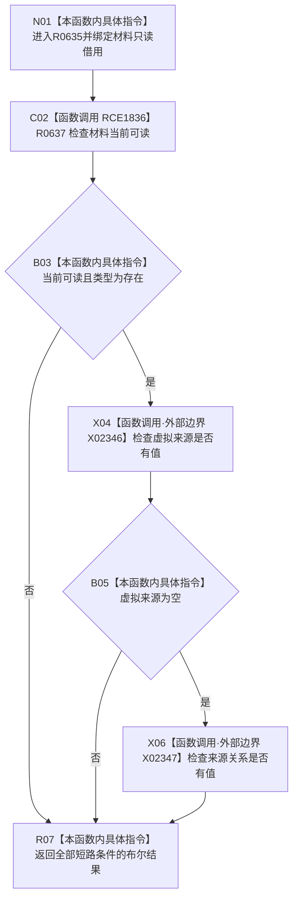

# CF-L9-0091 存在场景是实际存在现状流程图

图类型：现状流程图
代码版本：`03a8b7ac099ccea83e57f2696e2290b7bcdfacaf`
工作区复核基线：`7cbd2167eb5f6d495f48657a0e5badb07c52a358`
源码 blob：`524922ab2f3d0d76cfed4bdd517f0d7d57e1ae6a`
覆盖文件：`海中鱼巣/领域/数据操作.存在场景.ixx:417-420`
唯一根函数：R0635
完整签名：`bool 海中鱼巣::存在场景数据操作::是实际存在(const 海中鱼巣::节点身份材料& 材料) noexcept`
参数：`材料` 为调用期间有效的非拥有只读借用
返回结果：材料当前可读、类型为存在且虚拟来源与来源关系均为空时返回 `true`，否则返回 `false`
调用图：`流程图/主程序可达调用关系/01_main可达项目调用边表.md`
输入契约 / 调用语境表：本图“当前边界”节；未另建独立表
非成功返回二分审查表：本图返回节点与“当前边界”节；未另建独立表
偏差清单：无 / 不适用；本图只登记当前实现事实
依据提交 / 结构化消息：源码冻结 `03a8b7ac099ccea83e57f2696e2290b7bcdfacaf`；无结构化执行消息
验证输出：配对逐行映射、节点集合、源码 blob 与本批机械审计
已登记调用方：R0633（RCE1818）、R0650（RCE1910）、R0652（RCE1932）
直接项目函数：R0637（RCE1836）
外部边界：X02346、X02347（两个 optional 的 `has_value()`）
逐行映射表：`流程图/代码流程图/L9/CF-L9-0091_存在场景是实际存在_逐行代码映射表.md`
结构读写：只读材料，不修改结构
逻辑内返回：任一短路条件不成立时返回 `false`
内部错误：本函数无独立内部错误分支
生命周期与资源释放：无资源获取；借用仅在调用期间有效
不得作为施工许可：是
不得宣称：返回 `true` 等于材料已持久发布或来源结构已经完整验证

## 流程图

## 当前边界

- 第 418—419 行按 `&&` 从左到右短路；前项失败时不调用后续 optional 边界。
- 本函数只判定当前材料形状，不读取持久层，也不证明材料来源的业务完整性。
