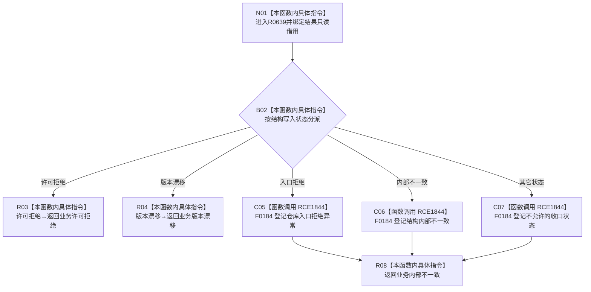

# CF-L9-0092 存在场景映射结构失败现状流程图

图类型：现状流程图
代码版本：`03a8b7ac099ccea83e57f2696e2290b7bcdfacaf`
工作区复核基线：`7cbd2167eb5f6d495f48657a0e5badb07c52a358`
源码 blob：`524922ab2f3d0d76cfed4bdd517f0d7d57e1ae6a`
覆盖文件：`海中鱼巣/领域/数据操作.存在场景.ixx:518-534`
唯一根函数：R0639
完整签名：`海中鱼巣::存在场景业务结果 海中鱼巣::存在场景数据操作::映射结构失败(const 海中鱼巣::结构写入结果& 结果)`
参数：`结果` 为调用期间有效的非拥有只读借用
返回结果：许可拒绝映射为许可拒绝，版本漂移映射为版本漂移；入口拒绝、内部不一致及其它状态均经追根因检查后映射为内部不一致
调用图：`流程图/主程序可达调用关系/01_main可达项目调用边表.md`
输入契约 / 调用语境表：本图“当前边界”节；未另建独立表
非成功返回二分审查表：本图返回节点与“当前边界”节；未另建独立表
偏差清单：无 / 不适用；本图只登记当前实现事实
依据提交 / 结构化消息：源码冻结 `03a8b7ac099ccea83e57f2696e2290b7bcdfacaf`；无结构化执行消息
验证输出：配对逐行映射、节点集合、源码 blob 与本批机械审计
已登记调用方：R0633（RCE1821）、R0651（RCE1926）、R0652（RCE1948）
直接项目函数：F0184（RCE1844，三处）
外部边界：无
逐行映射表：`流程图/代码流程图/L9/CF-L9-0092_存在场景映射结构失败_逐行代码映射表.md`
结构读写：只读结构写入状态；不修改仓库结构
逻辑内返回：许可拒绝与版本漂移
内部错误：入口拒绝、内部不一致和 default 分支经 F0184 登记后返回内部不一致
生命周期与资源释放：返回结果均为按值聚合结果，无资源获取
不得作为施工许可：是
不得宣称：追根因检查会修复结构状态，或 default 分支可视为普通业务结果

## 流程图

## 当前边界

- `switch` 没有把 `已提交` 作为允许输入；若到达 default，同样按内部不一致处理。
- F0184 只记录/触发当前追根因检查语义，不把错误状态转化为已修复事实。
