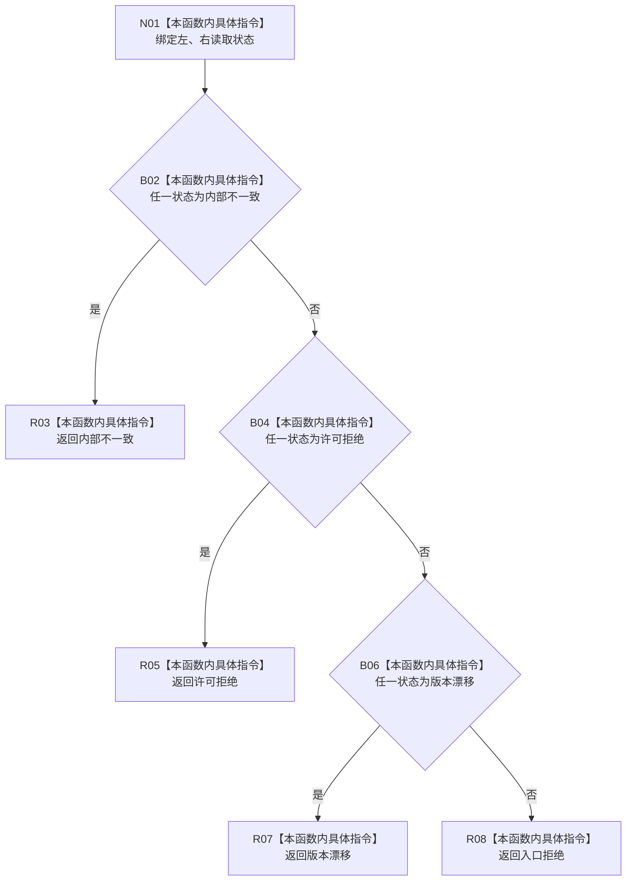

# CF-L9-0093 存在场景合并读取失败现状流程图

图类型：现状流程图
代码版本：`03a8b7ac099ccea83e57f2696e2290b7bcdfacaf`
当前工作区复核基线：`f19e4b0e001554d25b1cf0847dbcfb0b52d4e22c`
源码 blob：`524922ab2f3d0d76cfed4bdd517f0d7d57e1ae6a`
覆盖文件：`海中鱼巣/领域/数据操作.存在场景.ixx:428-441`
唯一根函数：R0653
完整签名：`海中鱼巣::存在场景读取状态 海中鱼巣::存在场景数据操作::合并读取失败(海中鱼巣::存在场景读取状态 左, 海中鱼巣::存在场景读取状态 右) noexcept`
参数：`左`、`右` 均按值输入
返回结果：任一内部不一致优先返回内部不一致；其次许可拒绝；其次版本漂移；其余组合返回入口拒绝
调用图：`流程图/主程序可达调用关系/01_main可达项目调用边表.md`
输入契约 / 调用语境表：本图“当前边界”节；未另建独立表
非成功返回二分审查表：本图返回节点与“当前边界”节；未另建独立表
偏差清单：无 / 不适用；本图只登记当前实现事实
依据提交 / 结构化消息：源码冻结 `03a8b7ac099ccea83e57f2696e2290b7bcdfacaf`；无结构化执行消息
验证输出：配对逐行映射、节点集合、源码 blob 与本批机械审计
已登记调用方：R0649、R0651（RCE1903、RCE1916）
直接项目函数：无
外部边界：无
逐行映射表：`流程图/代码流程图/L9/CF-L9-0093_存在场景合并读取失败_逐行代码映射表.md`
结构读写：只比较两个枚举值并返回枚举，不修改结构
不得作为施工许可：是
不得宣称：默认分支保留任一输入状态的原类别

## 流程图

## 当前边界

- 优先级固定为内部不一致、许可拒绝、版本漂移、入口拒绝；`未找到` 和 `已找到` 不被单独保留。
