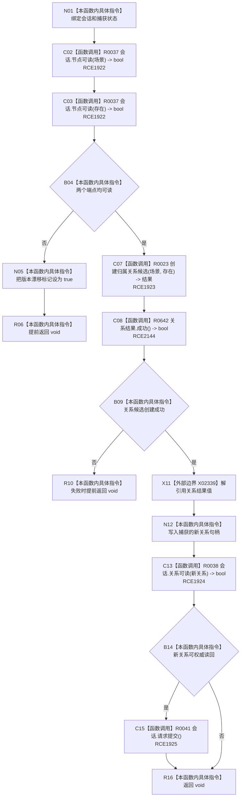

# CF-L9-0095 存在场景创建场景归属写入 lambda 现状流程图

图类型：现状流程图
代码版本：`03a8b7ac099ccea83e57f2696e2290b7bcdfacaf`
当前工作区复核基线：`f19e4b0e001554d25b1cf0847dbcfb0b52d4e22c`
源码 blob：`524922ab2f3d0d76cfed4bdd517f0d7d57e1ae6a`
覆盖文件：`海中鱼巣/领域/数据操作.存在场景.ixx:320-329`
唯一根函数：R0655
完整签名：`void 海中鱼巣::存在场景数据操作::创建场景归属(海中鱼巣::节点句柄, 海中鱼巣::节点句柄) const::<lambda@数据操作.存在场景.ixx:320>::operator()(海中鱼巣::结构写入会话& 会话) const`
参数：`会话` 以引用输入；lambda 捕获场景、存在、版本漂移标记和新关系局部状态
返回结果：`void`；端点不可读或候选失败时提前返回；完整关系可读时请求提交
调用图：`流程图/主程序可达调用关系/01_main可达项目调用边表.md`
输入契约 / 调用语境表：本图“当前边界”节；未另建独立表
非成功返回二分审查表：本图返回节点与“当前边界”节；未另建独立表
偏差清单：无 / 不适用；本图只登记当前实现事实
依据提交 / 结构化消息：源码冻结 `03a8b7ac099ccea83e57f2696e2290b7bcdfacaf`；无结构化执行消息
验证输出：配对逐行映射、节点集合、源码 blob 与本批机械审计
已登记调用方：R0116（RCE1921）；注册方 R0651（RCB0028）
直接项目函数：R0037、R0023、R0642、R0038、R0041（RCE1922—RCE1925、RCE2144）
外部边界：X02339
逐行映射表：`流程图/代码流程图/L9/CF-L9-0095_存在场景创建场景归属写入lambda_逐行代码映射表.md`
结构读写：在结构写入会话中创建归属关系候选；关系可权威读回时请求提交
不得作为施工许可：是
不得宣称：请求提交等于最终已提交，或回调已经过运行验证

## 流程图

## 当前边界

- 本回调只请求提交；最终提交、撤销和结构结果由 R0116 承载。
