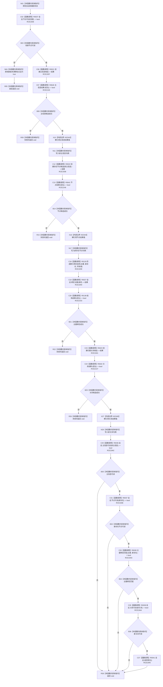

# CF-L9-0096 已有场景创建接纳写入 lambda 现状流程图

图类型：现状流程图
代码版本：`03a8b7ac099ccea83e57f2696e2290b7bcdfacaf`
当前工作区复核基线：`f19e4b0e001554d25b1cf0847dbcfb0b52d4e22c`
源码 blob：`524922ab2f3d0d76cfed4bdd517f0d7d57e1ae6a`
覆盖文件：`海中鱼巣/领域/数据操作.存在场景.ixx:366-387`
唯一根函数：R0656
完整签名：`void 海中鱼巣::存在场景数据操作::在已有场景中创建并接纳实际存在(海中鱼巣::节点句柄, std::uint64_t) const::<lambda@数据操作.存在场景.ixx:366>::operator()(海中鱼巣::结构写入会话& 会话) const`
参数：`会话` 以引用输入；lambda 捕获场景、存在主键、版本漂移标记及三个新句柄
返回结果：`void`；任一候选步骤失败即提前返回；主信息、节点、主键绑定和关系均可读回时请求提交
调用图：`流程图/主程序可达调用关系/01_main可达项目调用边表.md`
输入契约 / 调用语境表：本图“当前边界”节；未另建独立表
非成功返回二分审查表：本图返回节点与“当前边界”节；未另建独立表
偏差清单：无 / 不适用；本图只登记当前实现事实
依据提交 / 结构化消息：源码冻结 `03a8b7ac099ccea83e57f2696e2290b7bcdfacaf`；无结构化执行消息
验证输出：配对逐行映射、节点集合、源码 blob 与本批机械审计
已登记调用方：R0116（RCE1935）；注册方 R0652（RCB0029）
直接项目函数：R0037、R0021、R0640、R0022、R0641、R0129、R0027、R0138、R0023、R0642、R0036、R0638、R0038、R0041（RCE1936—RCE1945、RCE2145—RCE2147、RCE2153）
外部边界：X02343—X02345
逐行映射表：`流程图/代码流程图/L9/CF-L9-0096_已有场景创建接纳写入lambda_逐行代码映射表.md`
结构读写：在同一结构写入会话中形成主信息、存在节点、主键绑定和归属关系候选；完整读回时请求提交
不得作为施工许可：是
不得宣称：请求提交等于事务最终已提交，或回调已经过运行验证

## 流程图

## 当前边界

- 四项完整读回按 `&&` 短路顺序执行；任一失败均不请求提交。
- 本回调只设置提交请求；最终提交或撤销由 R0116 决定。
