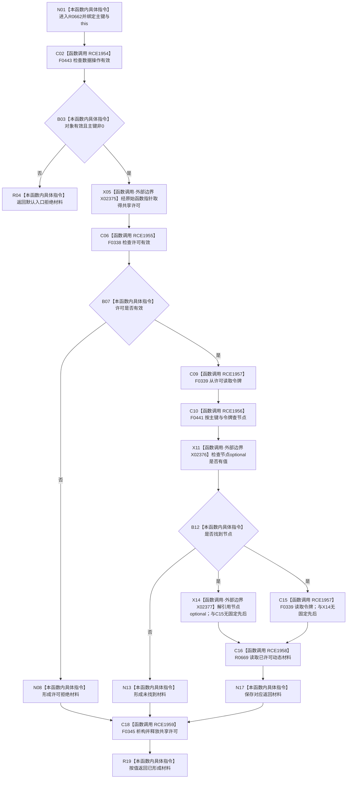

# CF-L9-0097 状态动态读取主键动态材料现状流程图

图类型：现状流程图
代码版本：`03a8b7ac099ccea83e57f2696e2290b7bcdfacaf`
当前工作区复核基线：`f19e4b0e001554d25b1cf0847dbcfb0b52d4e22c`
源码 blob：`cc399ea69282bf3ae0b0d59c7f0b587e5164b187`
覆盖文件：`海中鱼巣/领域/数据操作.状态动态.ixx:383-390`
唯一根函数：R0662
完整签名：`海中鱼巣::动态值式材料 海中鱼巣::状态动态数据操作::读取主键动态材料(std::uint64_t 主键) const`
参数：`主键` 按值传入，0 为非法入口；隐式 `this` 为非拥有只读借用
返回结果：对象无效或主键为 0 时返回默认入口拒绝材料；许可无效时返回许可拒绝；主键未找到节点时返回未找到；找到时返回已许可读取结果
已登记调用方：R0668（RCE1978）、R0674（RCE2018）、R0753（RCE2577）
直接项目函数：F0443（RCE1954）、F0338（RCE1955）、F0441（RCE1956）、F0339（RCE1957，两处）、R0669（RCE1958）、F0345（RCE1959，RAII 析构）
外部边界：X02375（共享许可原始函数指针调用）、X02376（节点 optional `has_value()`）、X02377（节点 optional 解引用）
逐行映射表：`流程图/代码流程图/L9/CF-L9-0097_状态动态读取主键动态材料_逐行代码映射表.md`
调用图：`流程图/主程序可达调用关系/01_main可达项目调用边表.md` 与 `02_main可达外部边界表.md`；入边 RCE1978、RCE2018、RCE2577，出边 RCE1954—RCE1959，外部边界 X02375—X02377
输入契约 / 调用语境表：本图参数、返回结果和“当前边界”内嵌审查；无独立文件
非成功返回二分审查表：本图入口拒绝、许可拒绝、未找到和透传返回内嵌审查；无独立文件
偏差清单：本函数当前代码事实未发现需单列偏差；无独立文件
依据提交 / 结构化消息：冻结代码提交 `03a8b7ac099ccea83e57f2696e2290b7bcdfacaf`；流程图维护切片复核基线 `f19e4b0e001554d25b1cf0847dbcfb0b52d4e22c`
验证输出：逐行覆盖、Mermaid/节点集合与未跟踪文件差异检查通过；`check_specs.py --strict` 为 108/108 PASS
结构读写：取得共享许可并只读主键索引与动态结构；不修改结构
逻辑内返回：入口拒绝、许可拒绝、未找到或被调读取材料状态
内部错误：本函数不重解释 R0669 返回的内部不一致等状态
生命周期与资源释放：取得许可后，所有返回路径均经 F0345 析构释放共享许可
不得作为施工许可：是
不得宣称：找到主键节点等于动态材料完整，或许可释放改变了仓库事实

## 流程图

## 当前边界

- 第 384 行按 `||` 短路；对象无效时不再比较主键，但两种入口失败都返回默认材料。
- 第 389 行 `*节点` 与 `许可.读取令牌()` 是同一函数调用的两个实参，C++ 不保证二者先后；图的双入边只表示两者都在 R0669 调用前完成，不表示并行执行。
- 第 385 行取得许可后，许可拒绝、未找到和成功读取三条路径均在函数退出前经 RCE1959 释放许可。
