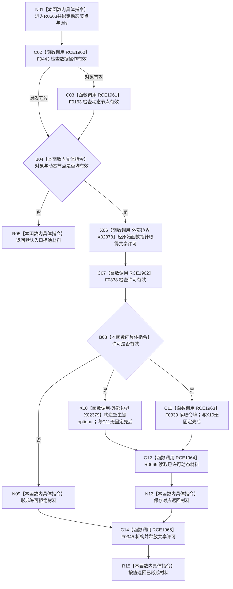

# CF-L9-0098 状态动态读取动态材料现状流程图

图类型：现状流程图
代码版本：`03a8b7ac099ccea83e57f2696e2290b7bcdfacaf`
当前工作区复核基线：`f19e4b0e001554d25b1cf0847dbcfb0b52d4e22c`
源码 blob：`cc399ea69282bf3ae0b0d59c7f0b587e5164b187`
覆盖文件：`海中鱼巣/领域/数据操作.状态动态.ixx:392-397`
唯一根函数：R0663
完整签名：`海中鱼巣::动态值式材料 海中鱼巣::状态动态数据操作::读取动态材料(海中鱼巣::节点句柄 动态节点) const`
参数：`动态节点` 按值传入；隐式 `this` 为非拥有只读借用
返回结果：对象或动态节点无效时返回默认入口拒绝材料；许可无效时返回许可拒绝；否则以空主键提示调用已许可读取并返回其材料
已登记调用方：R0661（RCE1953）
直接项目函数：F0443（RCE1960）、F0163（RCE1961）、F0338（RCE1962）、F0339（RCE1963）、R0669（RCE1964）、F0345（RCE1965，RAII 析构）
外部边界：X02378（共享许可原始函数指针调用）、X02379（构造空主键 optional）
逐行映射表：`流程图/代码流程图/L9/CF-L9-0098_状态动态读取动态材料_逐行代码映射表.md`
调用图：`流程图/主程序可达调用关系/01_main可达项目调用边表.md` 与 `02_main可达外部边界表.md`；入边 RCE1953，出边 RCE1960—RCE1965，外部边界 X02378、X02379
输入契约 / 调用语境表：本图参数、返回结果和“当前边界”内嵌审查；无独立文件
非成功返回二分审查表：本图入口拒绝、许可拒绝和透传返回内嵌审查；无独立文件
偏差清单：本函数当前代码事实未发现需单列偏差；无独立文件
依据提交 / 结构化消息：冻结代码提交 `03a8b7ac099ccea83e57f2696e2290b7bcdfacaf`；流程图维护切片复核基线 `f19e4b0e001554d25b1cf0847dbcfb0b52d4e22c`
验证输出：逐行覆盖、Mermaid/节点集合与未跟踪文件差异检查通过；`check_specs.py --strict` 为 108/108 PASS
结构读写：取得共享许可并只读动态结构；不修改结构
逻辑内返回：入口拒绝、许可拒绝或被调读取材料状态
内部错误：本函数不重解释 R0669 返回状态
生命周期与资源释放：取得许可后，许可拒绝和成功读取路径均经 F0345 析构释放共享许可
不得作为施工许可：是
不得宣称：有效句柄等于动态材料存在，或空主键 optional 会改变读取身份

## 流程图

## 当前边界

- 第 393 行按 `||` 短路：对象无效时不调用 F0163；图中 B04 汇总两项入口结果。
- 第 396 行 `std::nullopt` 构造与 `许可.读取令牌()` 是同一调用的不同实参，先后未规定；双入边不表示并行执行。
- 第 394 行取得许可后，两条返回路径均在退出前经 RCE1965 释放许可。
