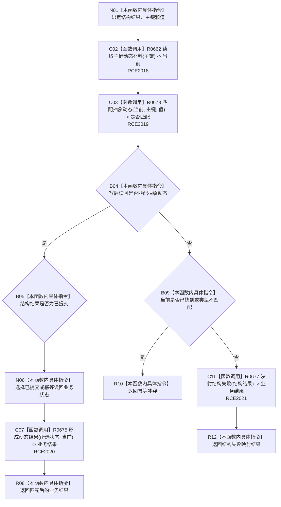

# CF-L9-0101 收口抽象动态现状流程图

图类型：现状流程图
代码版本：`03a8b7ac099ccea83e57f2696e2290b7bcdfacaf`
当前工作区复核基线：`9128ad4375a977d2744b00fcd6f9788d73b4aa7d`
源码 blob：`cc399ea69282bf3ae0b0d59c7f0b587e5164b187`
覆盖文件：`海中鱼巣/领域/数据操作.状态动态.ixx:1713-1729`
唯一根函数：R0674
完整签名：`海中鱼巣::状态动态业务结果 海中鱼巣::状态动态数据操作::收口抽象动态(const 海中鱼巣::结构写入结果& 结构结果, std::uint64_t 主键, std::int64_t 值) const`
参数：`结构结果` 为只读引用，承载写入会话收口状态；`主键` 与 `值` 按值输入，用于写后读回匹配
返回结果：写后读回匹配时返回已提交或幂等读回；已存在但不匹配时返回幂等冲突；其余状态交由 R0677 映射
调用图：`流程图/主程序可达调用关系/01_main可达项目调用边表.md`
逐行映射表：`流程图/代码流程图/L9/CF-L9-0101_收口抽象动态_逐行代码映射表.md`
输入契约 / 调用语境表：本图“当前边界”节；未另建独立表
非成功返回二分审查表：本图返回节点与“当前边界”节；未另建独立表
偏差清单：无 / 不适用；本图只登记当前实现事实
依据提交 / 结构化消息：源码冻结 `03a8b7ac099ccea83e57f2696e2290b7bcdfacaf`；无结构化执行消息
验证输出：配对逐行映射、节点集合、源码 blob 与本批机械审计
已登记调用方：R0668（RCE1994）
直接项目函数：R0662、R0673、R0675、R0677（RCE2018—RCE2021）
外部边界：无
结构读写：读取主键对应的当前动态材料；本函数不再写结构，只据写后读回和结构结果形成业务结果
不得作为施工许可：是
不得宣称：结构写入一定成功、写后读回一定存在，或本路径已经过运行验证

## 流程图

## 当前边界

- 本函数由创建抽象动态入口在写回调结束后调用，输入属于正式内部流程材料。
- 已找到但内容不匹配以及类型不匹配均按幂等冲突返回；其它未能形成匹配读回的路径交给 R0677 依据结构结果裁决。
