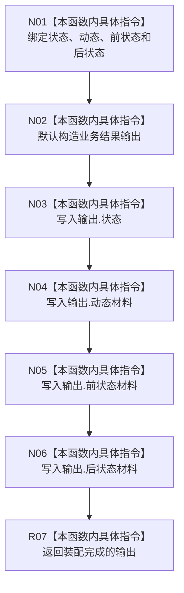

# CF-L9-0102 形成动态结果现状流程图

图类型：现状流程图
代码版本：`03a8b7ac099ccea83e57f2696e2290b7bcdfacaf`
当前工作区复核基线：`9128ad4375a977d2744b00fcd6f9788d73b4aa7d`
源码 blob：`cc399ea69282bf3ae0b0d59c7f0b587e5164b187`
覆盖文件：`海中鱼巣/领域/数据操作.状态动态.ixx:1761-1772`
唯一根函数：R0675
完整签名：`static 海中鱼巣::状态动态业务结果 海中鱼巣::状态动态数据操作::形成动态结果(海中鱼巣::状态动态业务状态 状态, const 海中鱼巣::动态值式材料& 动态, const 海中鱼巣::状态值式材料& 前状态 = {}, const 海中鱼巣::状态值式材料& 后状态 = {})`
参数：`状态` 按值输入；`动态`、`前状态`、`后状态` 为只读引用，其中两份状态材料允许调用方省略并使用默认空值
返回结果：返回逐字段装配的 `状态动态业务结果`
调用图：`流程图/主程序可达调用关系/01_main可达项目调用边表.md`
逐行映射表：`流程图/代码流程图/L9/CF-L9-0102_形成动态结果_逐行代码映射表.md`
输入契约 / 调用语境表：本图“当前边界”节；未另建独立表
非成功返回二分审查表：无独立非成功分支；业务状态由调用方传入
偏差清单：无 / 不适用；本图只登记当前实现事实
依据提交 / 结构化消息：源码冻结 `03a8b7ac099ccea83e57f2696e2290b7bcdfacaf`；无结构化执行消息
验证输出：配对逐行映射、节点集合、源码 blob 与本批机械审计
已登记调用方：R0668、R0674（RCE1980、RCE2020）
直接项目函数：无
外部边界：无
结构读写：只装配返回值局部对象，不读写持久结构
不得作为施工许可：是
不得宣称：传入状态已经过合法性校验，或形成的结果已经过运行验证

## 流程图

## 当前边界

- 本函数是纯装配辅助函数，调用方负责确定业务状态与材料语义。
- 默认空的前后状态材料只说明调用方省略了对应参数，不证明业务状态成功或失败。
