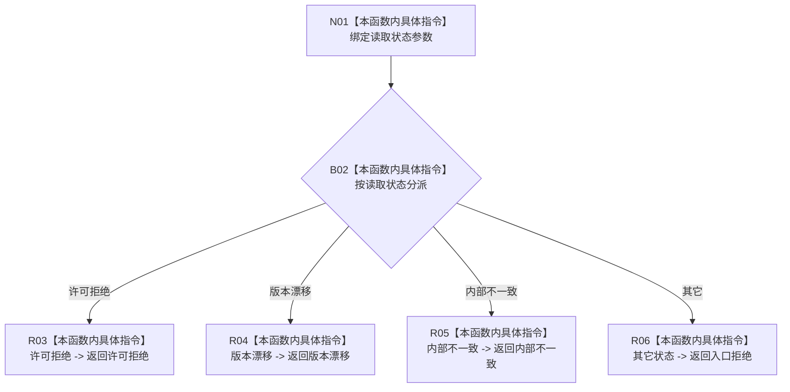

# CF-L9-0103 从读取失败形成状态动态结果现状流程图

图类型：现状流程图
代码版本：`03a8b7ac099ccea83e57f2696e2290b7bcdfacaf`
当前工作区复核基线：`9128ad4375a977d2744b00fcd6f9788d73b4aa7d`
源码 blob：`cc399ea69282bf3ae0b0d59c7f0b587e5164b187`
覆盖文件：`海中鱼巣/领域/数据操作.状态动态.ixx:1774-1785`
唯一根函数：R0676
完整签名：`static 海中鱼巣::状态动态业务结果 海中鱼巣::状态动态数据操作::从读取失败形成结果(海中鱼巣::状态动态读取状态 状态) noexcept`
参数：`状态` 按值输入，表示上游动态读取结果状态
返回结果：许可拒绝、版本漂移、内部不一致保持同类业务状态；其它输入统一映射为入口拒绝
调用图：`流程图/主程序可达调用关系/01_main可达项目调用边表.md`
逐行映射表：`流程图/代码流程图/L9/CF-L9-0103_从读取失败形成状态动态结果_逐行代码映射表.md`
输入契约 / 调用语境表：本图“当前边界”节；未另建独立表
非成功返回二分审查表：全部返回均为上游读取失败映射；分类见本图“当前边界”节
偏差清单：无 / 不适用；本图只登记当前实现事实
依据提交 / 结构化消息：源码冻结 `03a8b7ac099ccea83e57f2696e2290b7bcdfacaf`；无结构化执行消息
验证输出：配对逐行映射、节点集合、源码 blob 与本批机械审计
已登记调用方：R0668（RCE1981）
直接项目函数：无
外部边界：无
结构读写：不读写结构，只映射输入枚举状态
不得作为施工许可：是
不得宣称：默认分支一定只接收未找到或类型不匹配，或这些状态已通过运行验证

## 流程图

## 当前边界

- 本函数消费 R0668 写前读取失败状态，不产生结构变化。
- 许可拒绝和版本漂移为流程可传播结果；内部不一致应追根因；默认入口拒绝覆盖其余读取状态，具体来源仍由调用方语境决定。
