# CF-L9-0104 创建抽象动态写入 lambda 现状流程图

图类型：现状流程图
代码版本：`03a8b7ac099ccea83e57f2696e2290b7bcdfacaf`
当前工作区复核基线：`9128ad4375a977d2744b00fcd6f9788d73b4aa7d`
源码 blob：`cc399ea69282bf3ae0b0d59c7f0b587e5164b187`
覆盖文件：`海中鱼巣/领域/数据操作.状态动态.ixx:531-546`
唯一根函数：R0678
完整签名：`void 海中鱼巣::状态动态数据操作::创建抽象动态(std::uint64_t, std::int64_t) const::<lambda@数据操作.状态动态.ixx:531>::operator()(海中鱼巣::结构写入会话& 会话) const`
参数：`会话` 为 R0116 同步传入的可写非拥有引用；lambda 按引用捕获外层 `主键`、`动态材料`、`新主信息` 与 `新动态`
返回结果：`void`；任一候选操作失败即提前返回，完整读回成立时请求提交
调用图：`流程图/主程序可达调用关系/01_main可达项目调用边表.md`
逐行映射表：`流程图/代码流程图/L9/CF-L9-0104_创建抽象动态写入lambda_逐行代码映射表.md`
输入契约 / 调用语境表：本图“当前边界”节；未另建独立表
非成功返回二分审查表：候选创建、值写入、节点创建或主键绑定失败均提前结束回调，由 R0116 的结构结果承载失败
偏差清单：无 / 不适用；本图只登记当前实现事实
依据提交 / 结构化消息：源码冻结 `03a8b7ac099ccea83e57f2696e2290b7bcdfacaf`；无结构化执行消息
验证输出：配对逐行映射、节点集合、源码 blob 与本批机械审计
已登记调用方：R0116（RCE1983）；注册方 R0668 经 RCB0031 形成同步回调
直接项目函数：R0021、R0640、R0028、R0138、R0022、R0641、R0129、R0027、R0036、R0029、R0037、R0638、R0041（RCE1984—RCE1993、RCE2148—RCE2149、RCE2154）
外部边界：X02383、X02384（解引用两份候选句柄）
结构读写：在会话候选层创建主信息与动态节点、写动态值并绑定主键；只在全部候选可读且匹配时请求提交
不得作为施工许可：是
不得宣称：请求提交必然提交、提前返回不会影响外层结果，或结构已经过运行读回验证

## 流程图

```mermaid
flowchart TD
    N01["N01【本函数内具体指令】绑定会话并引用捕获外层材料<br/>RCB0031 / RCE1983"]
    C02["C02【函数调用】R0021 会话.创建主信息候选() -> 主结果<br/>RCE1984"]
    C03["C03【函数调用】R0640 主结果.成功() -> bool<br/>RCE2148"]
    B04{"B04【本函数内具体指令】主信息候选是否成功"}
    R05["R05【本函数内具体指令】失败则提前返回 void"]
    X06["X06【外部边界 X02383】解引用主结果.值"]
    N07["N07【本函数内具体指令】把候选主信息写入捕获变量"]
    C08["C08【函数调用】R0028 写入候选I64值(新主信息, 动态材料槽位, 动态材料) -> 写值结果<br/>RCE1985"]
    C09["C09【函数调用】R0138 写值结果.成功() -> bool<br/>RCE2154"]
    B10{"B10【本函数内具体指令】候选动态值是否写入成功"}
    R11["R11【本函数内具体指令】失败则提前返回 void"]
    C12["C12【函数调用】R0022 创建节点候选(动态, 新主信息) -> 节点结果<br/>RCE1986"]
    C13["C13【函数调用】R0641 节点结果.成功() -> bool<br/>RCE2149"]
    B14{"B14【本函数内具体指令】动态节点候选是否成功"}
    R15["R15【本函数内具体指令】失败则提前返回 void"]
    X16["X16【外部边界 X02384】解引用节点结果.值"]
    N17["N17【本函数内具体指令】把候选动态节点写入捕获变量"]
    C18["C18【函数调用】R0129 形成索引绑定请求(主键, 新动态, 状态动态) -> 请求<br/>RCE1987"]
    C19["C19【函数调用】R0027 会话.绑定主键(请求) -> 绑定结果<br/>RCE1988"]
    C20["C20【函数调用】R0138 绑定结果.成功() -> bool<br/>RCE2154"]
    B21{"B21【本函数内具体指令】主键绑定是否成功"}
    R22["R22【本函数内具体指令】失败则提前返回 void"]
    C23["C23【函数调用】R0036 会话.主信息可读(新主信息) -> bool<br/>RCE1989"]
    B24{"B24【本函数内具体指令】候选主信息是否可读"}
    C25["C25【函数调用】R0029 候选I64值匹配(新主信息, 槽位, 动态材料) -> bool<br/>RCE1990"]
    B26{"B26【本函数内具体指令】候选动态值是否匹配"}
    C27["C27【函数调用】R0037 会话.节点可读(新动态) -> bool<br/>RCE1991"]
    B28{"B28【本函数内具体指令】候选动态节点是否可读"}
    C29["C29【函数调用】R0638 主键绑定匹配(主键, 新动态) -> bool<br/>RCE1992"]
    B30{"B30【本函数内具体指令】候选主键绑定是否匹配"}
    N31["N31【本函数内具体指令】将完整读回定为 false"]
    N32["N32【本函数内具体指令】将完整读回定为 true"]
    B33{"B33【本函数内具体指令】完整读回是否成立"}
    C34["C34【函数调用】R0041 会话.请求提交() -> bool（结果丢弃）<br/>RCE1993"]
    N35["N35【本函数内具体指令】结束回调并返回 void"]
    N01 --> C02 --> C03 --> B04
    B04 -- 否 --> R05
    B04 -- 是 --> X06 --> N07 --> C08 --> C09 --> B10
    B10 -- 否 --> R11
    B10 -- 是 --> C12 --> C13 --> B14
    B14 -- 否 --> R15
    B14 -- 是 --> X16 --> N17 --> C18 --> C19 --> C20 --> B21
    B21 -- 否 --> R22
    B21 -- 是 --> C23 --> B24
    B24 -- 否 --> N31
    B24 -- 是 --> C25 --> B26
    B26 -- 否 --> N31
    B26 -- 是 --> C27 --> B28
    B28 -- 否 --> N31
    B28 -- 是 --> C29 --> B30
    B30 -- 否 --> N31
    B30 -- 是 --> N32
    N31 --> B33
    N32 --> B33
    B33 -- 是 --> C34 --> N35
    B33 -- 否 --> N35
```

## 当前边界

- R0668 只注册该 lambda，R0116 通过 RCB0031 同步调度并提供会话；lambda 正文独立于外层函数图展开。
- 所有提前返回都发生在请求提交之前；最终提交决定及失败状态由 R0116 收口，本函数不直接返回结构写入结果。
