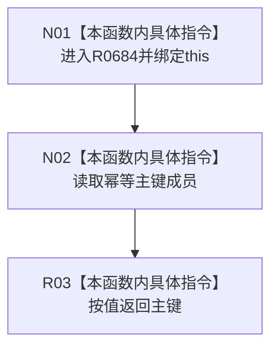

# CF-L9-0106 轻量因果写入规格读取幂等主键现状流程图

图类型：现状流程图
代码版本：`03a8b7ac099ccea83e57f2696e2290b7bcdfacaf`
工作区复核基线：`9128ad4375a977d2744b00fcd6f9788d73b4aa7d`
源码 blob：`fdc9a1b062b28feffec733dd1a0e342812ef1ddc`
覆盖文件：`海中鱼巣/领域/数据操作.轻量因果.ixx:71-71`
唯一根函数：R0684
完整签名：`std::uint64_t 海中鱼巣::轻量因果写入规格::读取幂等主键() const noexcept`
参数：隐式 `this` 为非拥有只读借用
返回结果：按值返回成员 `幂等主键_`
调用图：项目边表；入边 RCE2040
逐行映射表：`流程图/代码流程图/L9/CF-L9-0106_轻量因果写入规格读取幂等主键_逐行代码映射表.md`
输入契约 / 调用语境表：本图内嵌审查；无独立文件
非成功返回二分审查表：无分支；无独立文件
偏差清单：无独立偏差项
依据提交 / 结构化消息：冻结代码 `03a8b7ac…`；复核基线 `9128ad43…`
验证输出：逐行覆盖、Mermaid/节点集合、稳定 ID、无 HTML 与差异格式检查均通过；strict 108/108 PASS
不得作为施工许可：是
不得宣称：非 0 已由本访问器验证
结构读写：只读成员
逻辑内返回：无
内部错误：无
生命周期与资源释放：无

## 流程图

## 当前边界

- 本函数不校验主键。
