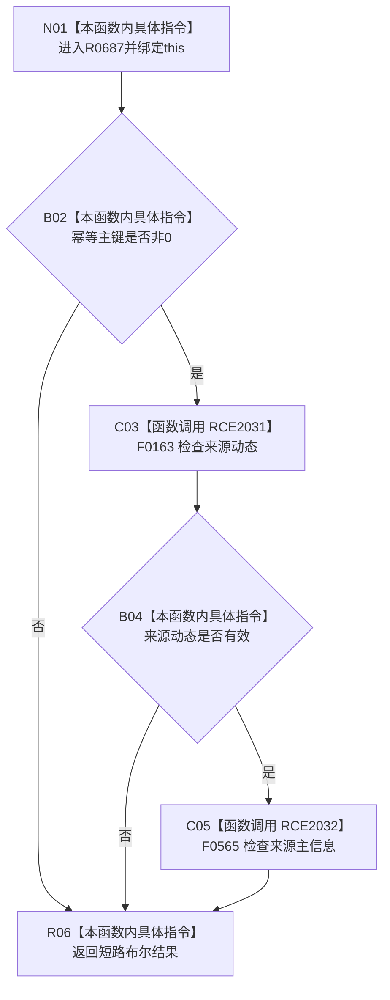

# CF-L9-0109 轻量因果写入规格完整现状流程图

图类型：现状流程图
代码版本：`03a8b7ac099ccea83e57f2696e2290b7bcdfacaf`
工作区复核基线：`9128ad4375a977d2744b00fcd6f9788d73b4aa7d`
源码 blob：`fdc9a1b062b28feffec733dd1a0e342812ef1ddc`
覆盖文件：`海中鱼巣/领域/数据操作.轻量因果.ixx:75-77`
唯一根函数：R0687
完整签名：`bool 海中鱼巣::轻量因果写入规格::完整() const noexcept`
参数：隐式 `this` 为非拥有只读借用
返回结果：幂等主键非 0、来源动态与来源主信息句柄均有效时返回 `true`
调用图：项目边表；入边 RCE2033、RCE2035，出边 RCE2031、RCE2032
逐行映射表：`流程图/代码流程图/L9/CF-L9-0109_轻量因果写入规格完整_逐行代码映射表.md`
输入契约 / 调用语境表：本图内嵌审查；无独立文件
非成功返回二分审查表：任一条件失败返回 `false`；无独立文件
偏差清单：无独立偏差项
依据提交 / 结构化消息：冻结代码 `03a8b7ac…`；复核基线 `9128ad43…`
验证输出：逐行覆盖、Mermaid/节点集合、稳定 ID、无 HTML 与差异格式检查均通过；strict 108/108 PASS
不得作为施工许可：是
不得宣称：完整等于来源动态当前可读或类型匹配
结构读写：只读规格成员
逻辑内返回：任一条件失败返回 `false`
内部错误：无独立内部错误分支
生命周期与资源释放：无资源获取

## 流程图

## 当前边界

- 第 76 行按 `&&` 从左到右短路，只验证非零与句柄有效性。
