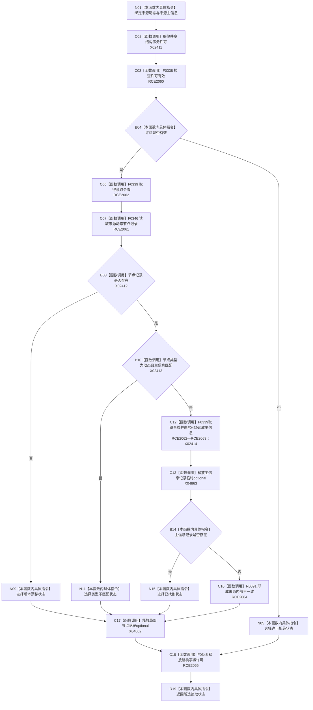

# CF-L9-0110 读取来源动态状态现状流程图

图类型：现状流程图
代码版本：`03a8b7ac099ccea83e57f2696e2290b7bcdfacaf`
当前工作区复核基线：`9128ad4375a977d2744b00fcd6f9788d73b4aa7d`
源码 blob：`fdc9a1b062b28feffec733dd1a0e342812ef1ddc`
覆盖文件：`海中鱼巣/领域/数据操作.轻量因果.ixx:181-194`
唯一根函数：R0690
完整签名：`海中鱼巣::轻量因果读取状态 海中鱼巣::轻量因果数据操作::读取来源动态状态(海中鱼巣::节点句柄 来源动态, 海中鱼巣::主信息句柄 来源主信息) const`
参数：`来源动态`、`来源主信息` 均按值输入
返回结果：许可拒绝、版本漂移、类型不匹配、已找到，或经 R0691 形成的内部不一致
调用图：`流程图/主程序可达调用关系/00_main可达函数身份表.md`、`01_main可达项目调用边表.md`、`02_main可达外部边界表.md`
已登记调用方：R0689（RCE2038）
直接项目函数：F0338（RCE2060）、F0346（RCE2061）、F0339（RCE2062）、F0439（RCE2063）、R0691（RCE2064）、F0345（RCE2065）
外部边界：X02411—X02414、X04862—X04863
逐行映射表：`流程图/代码流程图/L9/CF-L9-0110_读取来源动态状态_逐行代码映射表.md`
输入契约 / 调用语境表：本图内嵌审查；调用方提供来源动态句柄及其期望主信息锚点
非成功返回二分审查表：本图内嵌审查；许可/版本/类型为结构化结果，节点存在但主信息锚点不可读为追根因解决
偏差清单：无独立文件；本批只记录当前代码事实
依据提交 / 结构化消息：冻结源码提交 `03a8b7ac099ccea83e57f2696e2290b7bcdfacaf`、正式稳定边表及顶层稳定边界 ID 裁决 X04862—X04863
验证输出：Mermaid / 节点集合 / 逐行覆盖 PASS；目标 no-index 与全仓 diff 检查 PASS；strict 108/108 PASS；未构建、未运行
不得作为施工许可：是
不得宣称：共享许可一定可取得、来源动态与主信息仍当前可读

## 流程图

## 当前边界

- `记录` 的 `optional<节点记录>` 生命周期在节点读取后覆盖所有后继早退；主信息读取返回的 `optional<主信息记录>` 临时在 191 行完整表达式末释放。
- 节点记录存在且身份匹配，但主信息记录不存在时不是普通未找到，而是调用 R0691 返回内部不一致。
