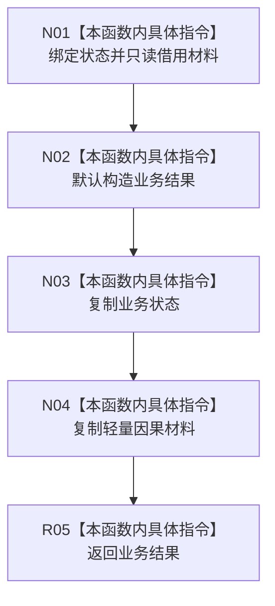

# CF-L9-0111 形成轻量因果结果现状流程图

图类型：现状流程图
代码版本：`03a8b7ac099ccea83e57f2696e2290b7bcdfacaf`
当前工作区复核基线：`9128ad4375a977d2744b00fcd6f9788d73b4aa7d`
源码 blob：`fdc9a1b062b28feffec733dd1a0e342812ef1ddc`
覆盖文件：`海中鱼巣/领域/数据操作.轻量因果.ixx:250-257`
唯一根函数：R0692
完整签名：`static 海中鱼巣::轻量因果业务结果 海中鱼巣::轻量因果数据操作::形成结果(海中鱼巣::轻量因果业务状态 状态, const 海中鱼巣::轻量因果值式材料& 材料)`
参数：`状态` 按值输入；`材料` 只读借用并复制到输出
返回结果：返回同时承载业务状态与轻量因果材料的值式业务结果
调用图：`流程图/主程序可达调用关系/00_main可达函数身份表.md`、`01_main可达项目调用边表.md`、`02_main可达外部边界表.md`
已登记调用方：R0689（RCE2043）
直接项目函数：无
外部边界：无
逐行映射表：`流程图/代码流程图/L9/CF-L9-0111_形成轻量因果结果_逐行代码映射表.md`
输入契约 / 调用语境表：本图内嵌审查；调用方提供已裁决状态与材料
非成功返回二分审查表：不适用；本函数不重新裁决状态
偏差清单：无独立文件；本批只记录当前代码事实
依据提交 / 结构化消息：冻结源码提交 `03a8b7ac099ccea83e57f2696e2290b7bcdfacaf` 与正式稳定边表
验证输出：Mermaid / 节点集合 / 逐行覆盖 PASS；目标 no-index 与全仓 diff 检查 PASS；strict 108/108 PASS；未构建、未运行
不得作为施工许可：是
不得宣称：传入状态与材料已经经过独立业务验证

## 流程图

## 当前边界

- 本函数只组装返回对象，不访问仓库、不验证材料完整性。
