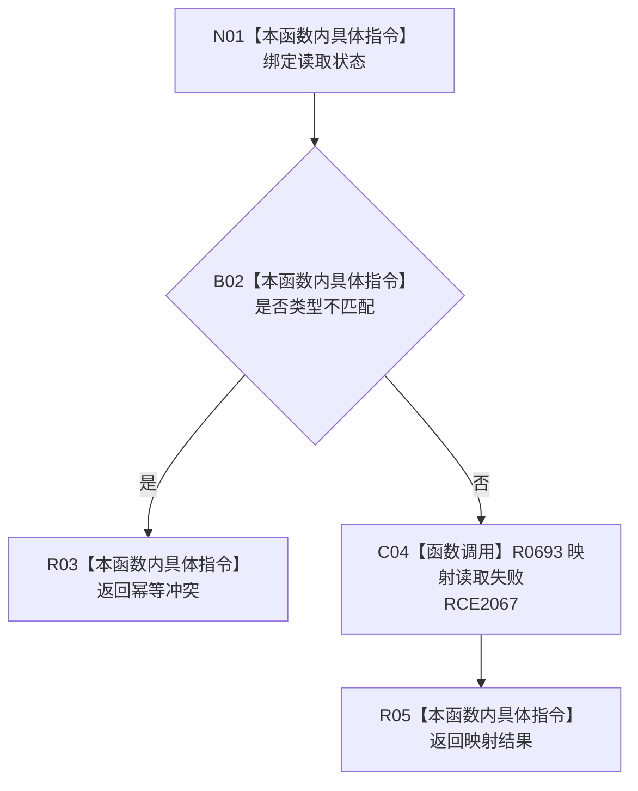

# CF-L9-0113 从读取冲突形成轻量因果结果现状流程图

图类型：现状流程图
代码版本：`03a8b7ac099ccea83e57f2696e2290b7bcdfacaf`
当前工作区复核基线：`9128ad4375a977d2744b00fcd6f9788d73b4aa7d`
源码 blob：`fdc9a1b062b28feffec733dd1a0e342812ef1ddc`
覆盖文件：`海中鱼巣/领域/数据操作.轻量因果.ixx:268-272`
唯一根函数：R0694
完整签名：`static 海中鱼巣::轻量因果业务结果 海中鱼巣::轻量因果数据操作::从读取冲突形成结果(海中鱼巣::轻量因果读取状态 状态) noexcept`
参数：`状态` 按值输入
返回结果：类型不匹配映射为幂等冲突；其它状态委托 R0693 映射
调用图：`流程图/主程序可达调用关系/00_main可达函数身份表.md`、`01_main可达项目调用边表.md`、`02_main可达外部边界表.md`
已登记调用方：R0689（RCE2044）
直接项目函数：R0693（RCE2067）
外部边界：无
逐行映射表：`流程图/代码流程图/L9/CF-L9-0113_从读取冲突形成轻量因果结果_逐行代码映射表.md`
输入契约 / 调用语境表：本图内嵌审查；输入来自写前读取冲突路径
非成功返回二分审查表：本图内嵌审查；类型不匹配为幂等冲突，其它状态保持 R0693 口径
偏差清单：无独立文件；本批只记录当前代码事实
依据提交 / 结构化消息：冻结源码提交 `03a8b7ac099ccea83e57f2696e2290b7bcdfacaf` 与正式稳定边表
验证输出：Mermaid / 节点集合 / 逐行覆盖 PASS；目标 no-index 与全仓 diff 检查 PASS；strict 108/108 PASS；未构建、未运行
不得作为施工许可：是
不得宣称：所有非类型不匹配状态均属于普通入口拒绝

## 流程图

## 当前边界

- 本函数只为写前 `类型不匹配` 增加幂等冲突语义，不吞掉许可拒绝、版本漂移或内部不一致。
