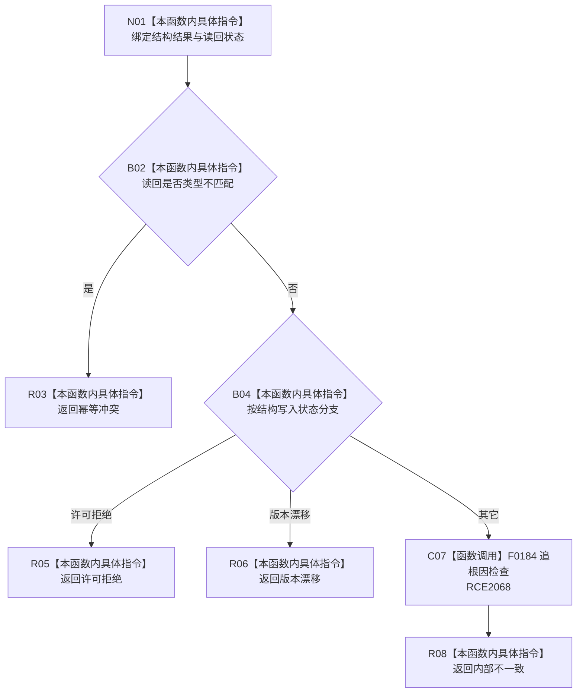

# CF-L9-0114 映射轻量因果结构失败现状流程图

图类型：现状流程图
代码版本：`03a8b7ac099ccea83e57f2696e2290b7bcdfacaf`
当前工作区复核基线：`9128ad4375a977d2744b00fcd6f9788d73b4aa7d`
源码 blob：`fdc9a1b062b28feffec733dd1a0e342812ef1ddc`
覆盖文件：`海中鱼巣/领域/数据操作.轻量因果.ixx:274-287`
唯一根函数：R0695
完整签名：`static 海中鱼巣::轻量因果业务结果 海中鱼巣::轻量因果数据操作::映射结构失败(const 海中鱼巣::结构写入结果& 结果, 海中鱼巣::轻量因果读取状态 读回状态)`
参数：`结果` 只读借用；`读回状态` 按值输入
返回结果：读回类型不匹配为幂等冲突；结构许可拒绝或版本漂移同名映射；其它情况触发追根因并返回内部不一致
调用图：`流程图/主程序可达调用关系/00_main可达函数身份表.md`、`01_main可达项目调用边表.md`、`02_main可达外部边界表.md`
已登记调用方：R0689（RCE2059）
直接项目函数：F0184（RCE2068）
外部边界：无
逐行映射表：`流程图/代码流程图/L9/CF-L9-0114_映射轻量因果结构失败_逐行代码映射表.md`
输入契约 / 调用语境表：本图内嵌审查；只用于写后材料不完整且未判定写前漂移的收口路径
非成功返回二分审查表：本图内嵌审查；许可/版本/冲突为结构化结果，其它不可读为追根因解决
偏差清单：无独立文件；本批只记录当前代码事实
依据提交 / 结构化消息：冻结源码提交 `03a8b7ac099ccea83e57f2696e2290b7bcdfacaf` 与正式稳定边表
验证输出：Mermaid / 节点集合 / 逐行覆盖 PASS；目标 no-index 与全仓 diff 检查 PASS；strict 108/108 PASS；未构建、未运行
不得作为施工许可：是
不得宣称：默认分支的结构或读回根因已经修复

## 流程图

## 当前边界

- 默认分支不是普通失败；代码明确触发追根因检查后返回内部不一致。
