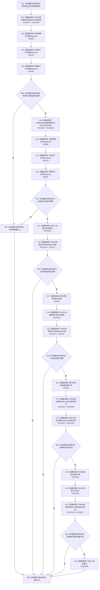

# CF-L9-0115 创建轻量因果写入lambda现状流程图

图类型：现状流程图
代码版本：`03a8b7ac099ccea83e57f2696e2290b7bcdfacaf`
当前工作区复核基线：`9128ad4375a977d2744b00fcd6f9788d73b4aa7d`
源码 blob：`fdc9a1b062b28feffec733dd1a0e342812ef1ddc`
覆盖文件：`海中鱼巣/领域/数据操作.轻量因果.ixx:147-166`
唯一根函数：R0696
完整签名：`void 海中鱼巣::轻量因果数据操作::创建轻量因果(const 海中鱼巣::轻量因果写入规格&) const::<lambda@数据操作.轻量因果.ixx:147>::operator()(海中鱼巣::结构写入会话& 会话) const`
参数：`会话` 可写借用；闭包按引用捕获规格、新主信息、新因果引用和写前漂移
返回结果：`void`；失败路径直接返回，由外层执行器结果和写后读回收口
调用图：`流程图/主程序可达调用关系/00_main可达函数身份表.md`、`01_main可达项目调用边表.md`、`02_main可达外部边界表.md`
已登记调用方：R0116（RCE2046）
直接项目函数：R0685（RCE2047）、R0686（RCE2048）、R0030（RCE2049）、R0031（RCE2050）、R0021（RCE2051）、R0022（RCE2052）、R0129（RCE2053）、R0027（RCE2054）、R0036（RCE2055）、R0037（RCE2056）、R0638（RCE2057）、R0041（RCE2058）、R0640（RCE2150）、R0641（RCE2151）、R0138（RCE2155）、R0684（RCE3325）
外部边界：X02415—X02420、X04864—X04867
逐行映射表：`流程图/代码流程图/L9/CF-L9-0115_创建轻量因果写入lambda_逐行代码映射表.md`
输入契约 / 调用语境表：本图内嵌审查；仅由 R0116 在结构写入会话内回调
非成功返回二分审查表：本图内嵌审查；写前快照漂移设置共享标志，其它候选/绑定/读回失败直接让执行器收口
偏差清单：RCE2040 的 lambda 内调用已拆账为 RCE3325；本图只使用校正后的稳定边
依据提交 / 结构化消息：冻结源码提交 `03a8b7ac099ccea83e57f2696e2290b7bcdfacaf`、正式稳定边表及顶层 X04864—X04867 / RCE3325 裁决
验证输出：Mermaid / 节点集合 / 逐行覆盖 PASS；目标 no-index 与全仓 diff 检查 PASS；strict 108/108 PASS；未构建、未运行
不得作为施工许可：是
不得宣称：请求提交一定成功、外层结构结果已提交或写后材料完整

## 流程图

## 当前边界

- 149、151 行各有读取返回临时和预期临时 `optional`；构造、比较与析构已分别使用 X04864—X04867 和 X02415—X02416。
- 162、164 行的 `读取幂等主键()` 实际属于 R0696，使用拆账后的 RCE3325，不沿用外层 R0689 的 RCE2040。
- 候选创建、绑定或完整读回失败仅返回回调；是否撤销、提交或形成何种结构结果由 R0116 负责。
