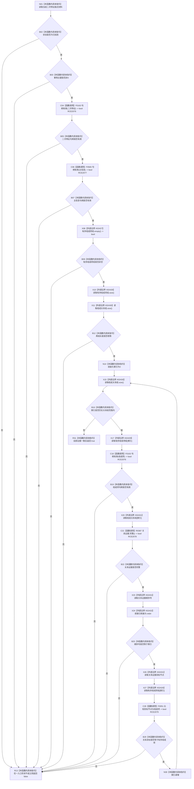

# CF-L9-0116 二次特征值式材料完整现状流程图

图类型：现状流程图
代码版本：`03a8b7ac099ccea83e57f2696e2290b7bcdfacaf`
当前工作区复核基线：`b8a49bcb141d4fb8940225954dc328e54600030b`
源码 blob：`a47cd9b07794d30abc6cb9d1df319056105cd596`
覆盖文件：`海中鱼巣/领域/数据操作.特征体系.ixx:167-179`
唯一根函数：R0700
完整签名：`bool 海中鱼巣::二次特征值式材料::完整() const noexcept`
参数：无显式参数；只读当前二次特征值式材料对象
返回结果：状态、主键、句柄、两组长度及每项证据全部一致时返回 true，否则返回 false
调用图：`流程图/主程序可达调用关系/01_main可达项目调用边表.md`
逐行映射表：`流程图/代码流程图/L9/CF-L9-0116_二次特征值式材料完整_逐行代码映射表.md`
输入契约 / 调用语境表：本图“当前边界”节；未另建独立表
非成功返回二分审查表：false 仅表示值式材料不满足完整形状；调用方依据读取语境决定业务结果
偏差清单：无 / 不适用；本图只登记当前实现事实
依据提交 / 结构化消息：源码冻结 `03a8b7ac099ccea83e57f2696e2290b7bcdfacaf`；无结构化执行消息
验证输出：配对逐行映射、节点集合、源码 blob 与本批机械审计
已登记调用方：R0701（RCE2087）
直接项目函数：F0163、F0565、R0387、F0051（RCE2076—RCE2079）
外部边界：X02427—X02432（vector 空判、长度、索引与顺序号转换）
结构读写：无；只读当前值式材料及其两个容器
不得作为施工许可：是
不得宣称：true 证明持久结构当前仍一致，或材料已经过独立运行验证

## 流程图

## 当前边界

- 本谓词验证的是一次读取形成的值式材料快照，不重新取得事务许可或读持久仓库。
- 有序组成项组与关系证据组必须一一对齐，关系顺序号从0连续并且目标节点逐项相同。
