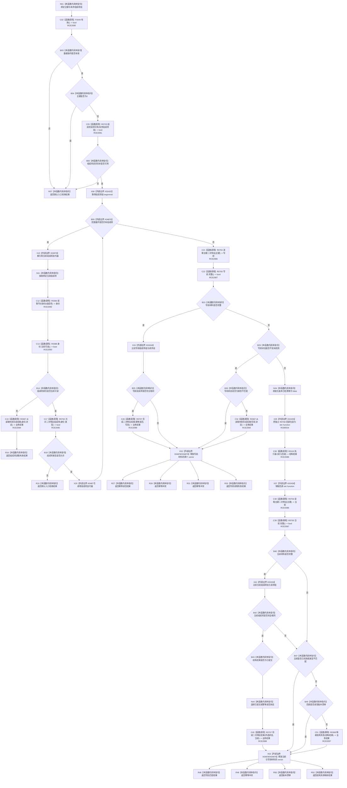

# CF-L9-0117 创建组合二次特征现状流程图

图类型：现状流程图
代码版本：`03a8b7ac099ccea83e57f2696e2290b7bcdfacaf`
当前工作区复核基线：`b8a49bcb141d4fb8940225954dc328e54600030b`
源码 blob：`a47cd9b07794d30abc6cb9d1df319056105cd596`
覆盖文件：`海中鱼巣/领域/数据操作.特征体系.ixx:918-974`
唯一根函数：R0701
完整签名：`海中鱼巣::特征体系业务结果 海中鱼巣::特征体系数据操作::创建组合二次特征(std::uint64_t 主键, const std::vector<海中鱼巣::节点句柄>& 有序组成项组) const`
参数：`主键` 按值输入且必须非0；`有序组成项组` 为只读引用，必须非空、句柄有效、无重复且类型准入
返回结果：入口不合法返回默认拒绝；组成项读取失败按状态映射；写前/写后匹配返回幂等读回或已提交；内容冲突返回幂等冲突；回调复核漂移返回版本漂移；其它结构失败交 R0368 映射
调用图：`流程图/主程序可达调用关系/01_main可达项目调用边表.md`
逐行映射表：`流程图/代码流程图/L9/CF-L9-0117_创建组合二次特征_逐行代码映射表.md`
输入契约 / 调用语境表：本图“当前边界”节；未另建独立表
非成功返回二分审查表：入口材料问题为逻辑内拒绝；已存在不匹配为幂等冲突；事务内组成项漂移为版本漂移；其余准入后异常由 R0367/R0368 保持根因语义
偏差清单：无 / 不适用；本图只登记当前实现事实
依据提交 / 结构化消息：源码冻结 `03a8b7ac099ccea83e57f2696e2290b7bcdfacaf`；无结构化执行消息
验证输出：配对逐行映射、节点集合、源码 blob 与本批机械审计
已登记调用方：R0697（RCE2075）
直接项目函数：F0444、R0703、R0383、R0388、R0367、R0702、R0704、R0700、R0707、R0116、R0368（RCE2080—RCE2089、RCE2097）
外部边界：X02433—X02436、X04875—X04879；回调 RCB0034 指向独立 R0708
结构读写：入口和写前阶段只读；R0116 同步调度 R0708 写回调；本函数随后写后读回并收口结果
不得作为施工许可：是
不得宣称：请求提交必然提交、回调正文属于本根函数，或创建路径已经过运行验证

## 流程图

## 当前边界

- R0708 是独立回调函数；本图只记录其包装、R0116 同步调度和销毁，不展开回调正文。
- 写前完整材料与请求相同直接幂等读回；写后当前材料相同才依据结构结果区分已提交与幂等读回。
- X04878/X04879 记录写前和当前值式材料内部 vector 的隐式作用域释放，不产生机器事实。
