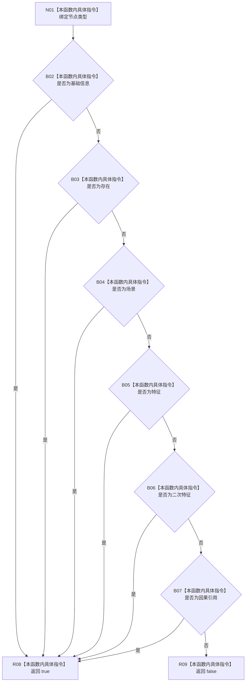

# CF-L9-0118 允许二次特征组成项现状流程图

图类型：现状流程图
代码版本：`03a8b7ac099ccea83e57f2696e2290b7bcdfacaf`
当前工作区复核基线：`b8a49bcb141d4fb8940225954dc328e54600030b`
源码 blob：`a47cd9b07794d30abc6cb9d1df319056105cd596`
覆盖文件：`海中鱼巣/领域/数据操作.特征体系.ixx:1006-1010`
唯一根函数：R0702
完整签名：`static bool 海中鱼巣::特征体系数据操作::允许二次特征组成项(海中鱼巣::节点类型 类型) noexcept`
参数：`类型` 按值输入
返回结果：基础信息、存在、场景、特征、二次特征或因果引用返回 true，其它类型返回 false
调用图：`流程图/主程序可达调用关系/01_main可达项目调用边表.md`
逐行映射表：`流程图/代码流程图/L9/CF-L9-0118_允许二次特征组成项_逐行代码映射表.md`
输入契约 / 调用语境表：本图“当前边界”节；未另建独立表
非成功返回二分审查表：false 表示类型不属于数据操作允许集合，具体收口由调用方决定
偏差清单：无 / 不适用；本图只登记当前实现事实
依据提交 / 结构化消息：源码冻结 `03a8b7ac099ccea83e57f2696e2290b7bcdfacaf`；无结构化执行消息
验证输出：配对逐行映射、节点集合、源码 blob 与本批机械审计
已登记调用方：R0701、R0708、R0705（RCE2085、RCE2092、RCE2111）
直接项目函数：无
外部边界：无
结构读写：无；只对节点类型枚举做纯判断
不得作为施工许可：是
不得宣称：允许类型已经形成有效组成项证据，或服务层与数据层重复谓词可互相替代

## 流程图

## 当前边界

- 本函数被创建前复核、写会话复核及读取证据复核共同调用。
- true 只证明类型枚举准入，不证明句柄、身份、关系证据或主键有效。
