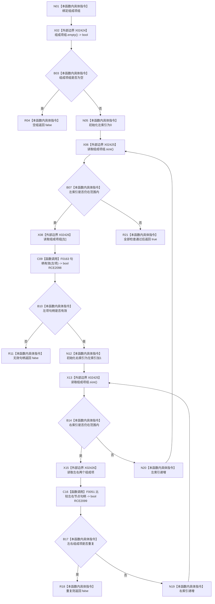

# CF-L9-0119 组成项请求可用现状流程图

图类型：现状流程图
代码版本：`03a8b7ac099ccea83e57f2696e2290b7bcdfacaf`
当前工作区复核基线：`b8a49bcb141d4fb8940225954dc328e54600030b`
源码 blob：`a47cd9b07794d30abc6cb9d1df319056105cd596`
覆盖文件：`海中鱼巣/领域/数据操作.特征体系.ixx:1012-1021`
唯一根函数：R0703
完整签名：`static bool 海中鱼巣::特征体系数据操作::组成项请求可用(const std::vector<海中鱼巣::节点句柄>& 组成项组)`
参数：`组成项组` 为只读引用；要求非空、每个句柄有效且任意两项不重复
返回结果：全部入口形状条件成立返回 true，否则返回 false
调用图：`流程图/主程序可达调用关系/01_main可达项目调用边表.md`
逐行映射表：`流程图/代码流程图/L9/CF-L9-0119_组成项请求可用_逐行代码映射表.md`
输入契约 / 调用语境表：本图“当前边界”节；未另建独立表
非成功返回二分审查表：空组、无效句柄或重复句柄均为创建入口材料拒绝
偏差清单：无 / 不适用；本图只登记当前实现事实
依据提交 / 结构化消息：源码冻结 `03a8b7ac099ccea83e57f2696e2290b7bcdfacaf`；无结构化执行消息
验证输出：配对逐行映射、节点集合、源码 blob 与本批机械审计
已登记调用方：R0701（RCE2081）
直接项目函数：F0163、F0051（RCE2098—RCE2099）
外部边界：X02424—X02426（vector 空判、长度与索引读取）
结构读写：无；只读取请求容器和节点句柄
不得作为施工许可：是
不得宣称：true 已证明组成项类型、当前身份或关系结构有效

## 流程图

## 当前边界

- 本函数只验证请求容器形状，R0701 随后逐项读取身份并复核允许类型。
- 二重索引扫描保持调用方提供的顺序，不排序也不改写输入容器。
