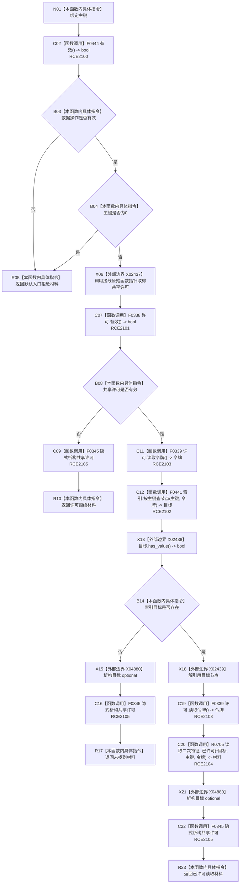

# CF-L9-0120 读取主键二次特征现状流程图

图类型：现状流程图
代码版本：`03a8b7ac099ccea83e57f2696e2290b7bcdfacaf`
当前工作区复核基线：`b8a49bcb141d4fb8940225954dc328e54600030b`
源码 blob：`a47cd9b07794d30abc6cb9d1df319056105cd596`
覆盖文件：`海中鱼巣/领域/数据操作.特征体系.ixx:651-658`
唯一根函数：R0704
完整签名：`海中鱼巣::二次特征值式材料 海中鱼巣::特征体系数据操作::读取主键二次特征(std::uint64_t 主键) const`
参数：`主键` 按值输入；0 为非法入口值
返回结果：未接域或零主键返回默认入口拒绝；许可无效返回许可拒绝；索引无节点返回未找到；找到节点时返回 R0705 的已许可读取材料
调用图：`流程图/主程序可达调用关系/01_main可达项目调用边表.md`
逐行映射表：`流程图/代码流程图/L9/CF-L9-0120_读取主键二次特征_逐行代码映射表.md`
输入契约 / 调用语境表：本图“当前边界”节；未另建独立表
非成功返回二分审查表：入口拒绝、许可拒绝和未找到为只读结果；R0705 内部不一致保持追根因语义
偏差清单：无 / 不适用；本图只登记当前实现事实
依据提交 / 结构化消息：源码冻结 `03a8b7ac099ccea83e57f2696e2290b7bcdfacaf`；无结构化执行消息
验证输出：配对逐行映射、节点集合、源码 blob 与本批机械审计
已登记调用方：R0701、R0754（RCE2086、RCE2578）
直接项目函数：F0444、F0338、F0339、F0441、R0705、F0345（RCE2100—RCE2105）
外部边界：X02437—X02439、X04880（许可取得函数指针、optional 检查/解引用/析构）
结构读写：取得共享读取许可后查询主键索引并只读二次特征材料；离开作用域释放许可
不得作为施工许可：是
不得宣称：取得许可即证明目标存在，或返回材料当前仍与后续结构一致

## 流程图

## 当前边界

- 原始函数指针由当前接线提供，X02437 只记录边界调用，不伪造新的项目函数身份。
- 共享许可在许可拒绝、未找到和成功返回路径均由 RCE2105 释放；目标 optional 在构造后的两条返回路径由 X04880 释放。
