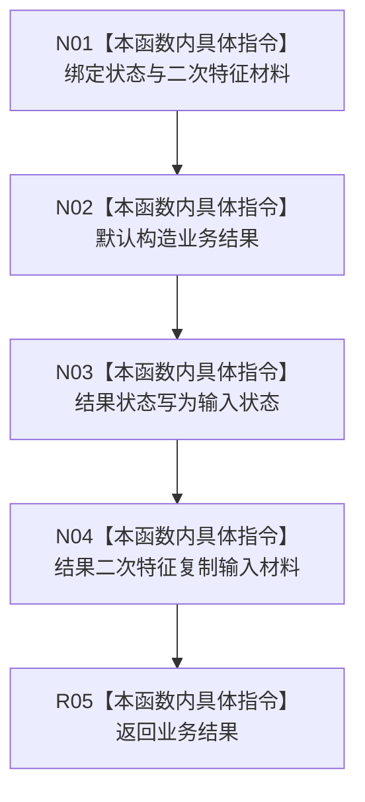

# CF-L9-0121 形成二次特征结果现状流程图

图类型：现状流程图
代码版本：`03a8b7ac099ccea83e57f2696e2290b7bcdfacaf`
当前工作区复核基线：`b8a49bcb141d4fb8940225954dc328e54600030b`
源码 blob：`a47cd9b07794d30abc6cb9d1df319056105cd596`
覆盖文件：`海中鱼巣/领域/数据操作.特征体系.ixx:1609-1616`
唯一根函数：R0707
完整签名：`static 海中鱼巣::特征体系业务结果 海中鱼巣::特征体系数据操作::形成二次特征结果(海中鱼巣::特征体系业务状态 状态, const 海中鱼巣::二次特征值式材料& 二次特征)`
参数：`状态` 按值传入；`二次特征` 为只读借用，生命周期由调用方覆盖本次调用
返回结果：返回复制了业务状态和二次特征材料的 `特征体系业务结果`
调用图：`流程图/主程序可达调用关系/00_main可达函数身份表.md`、`01_main可达项目调用边表.md`、`02_main可达外部边界表.md`
已登记调用方：R0701（RCE2088，写前幂等读回与写后读回两个调用点）
直接项目函数：无
外部边界：无
逐行映射表：`流程图/代码流程图/L9/CF-L9-0121_形成二次特征结果_逐行代码映射表.md`
输入契约 / 调用语境表：本图内嵌审查；调用方已经决定状态并提供对应二次特征材料
非成功返回二分审查表：不适用；本函数不裁决成功或非成功，仅组装调用方给定结果
偏差清单：无独立文件；本批只记录当前代码事实
依据提交 / 结构化消息：冻结源码提交 `03a8b7ac099ccea83e57f2696e2290b7bcdfacaf` 与正式稳定边表
验证输出：Mermaid / 节点集合 / 逐行覆盖 PASS；目标 no-index 与 strict 检查 PASS；未构建、未运行
不得作为施工许可：是
不得宣称：给定状态与材料组合符合所有业务契约，或结果已经通过运行验证

## 流程图

## 当前边界

- 本函数只组装值式结果，不读取或修改仓库，也不重新解释调用方传入的状态。
