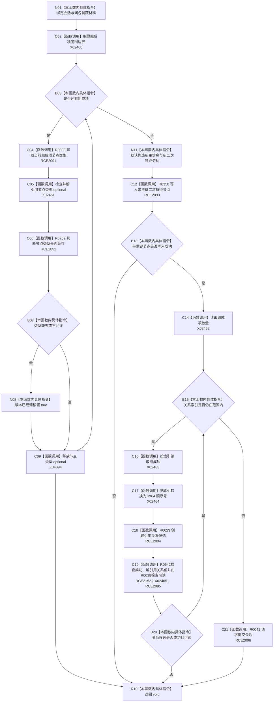

# CF-L9-0122 组合二次特征写入 lambda 现状流程图

图类型：现状流程图
代码版本：`03a8b7ac099ccea83e57f2696e2290b7bcdfacaf`
当前工作区复核基线：`b8a49bcb141d4fb8940225954dc328e54600030b`
源码 blob：`a47cd9b07794d30abc6cb9d1df319056105cd596`
覆盖文件：`海中鱼巣/领域/数据操作.特征体系.ixx:941-960`
唯一根函数：R0708
完整签名：`void 海中鱼巣::特征体系数据操作::创建组合二次特征(std::uint64_t, const std::vector<海中鱼巣::节点句柄>&) const::<lambda@数据操作.特征体系.ixx:941>::operator()(海中鱼巣::结构写入会话& 会话) const`
参数：`会话` 为可写借用；闭包按引用捕获有序组成项组、主键和版本漂移标志
返回结果：`void`；失败路径直接返回，由外层 R0701 根据执行器结果、写后读回和版本漂移标志收口
调用图：`流程图/主程序可达调用关系/00_main可达函数身份表.md`、`01_main可达项目调用边表.md`、`02_main可达外部边界表.md`
已登记调用方：R0116（RCE2090）；回调登记 RCB0034 记录 R0701 在 941 行形成闭包并由 R0116 同步调度
直接项目函数：R0030（RCE2091）、R0702（RCE2092）、R0358（RCE2093）、R0023（RCE2094）、R0038（RCE2095）、R0041（RCE2096）、R0642（RCE2152）
外部边界：X02460—X02465、X04894
逐行映射表：`流程图/代码流程图/L9/CF-L9-0122_组合二次特征写入lambda_逐行代码映射表.md`
输入契约 / 调用语境表：本图内嵌审查；仅由 R0116 在结构写入会话内同步回调，外层已完成入口、组成项身份和写前幂等检查
非成功返回二分审查表：本图内嵌审查；类型漂移写入共享标志，其它候选创建或关系读回失败直接让执行器与外层写后读回收口
偏差清单：补登记标准库生命周期边界 X04894；无新增项目调用边
依据提交 / 结构化消息：冻结源码提交 `03a8b7ac099ccea83e57f2696e2290b7bcdfacaf`、正式稳定边表及顶层 X04894 裁决
验证输出：Mermaid / 节点集合 / 逐行覆盖 PASS；目标 no-index 与 strict 检查 PASS；未构建、未运行
不得作为施工许可：是
不得宣称：请求提交一定成功、外层结构结果已提交、或写后二次特征材料完整

## 流程图

## 当前边界

- 943 行局部 `optional<节点类型>` 在每轮结束或 946 行提前返回前释放，使用稳定边界 X04894；运行期次数随组成项数量变化。
- 回调只形成候选并请求提交；候选失败、读回失败、撤销或提交结果由 R0116 与外层 R0701 处理。
- `版本已经漂移` 是闭包共享局部标志，不是仓库状态。
