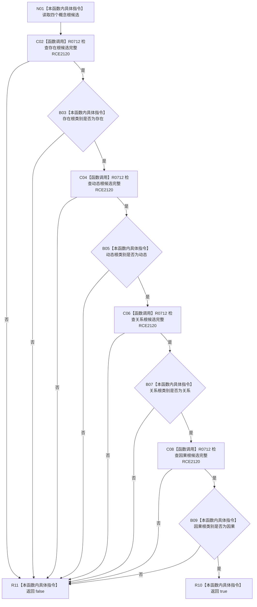

# CF-L9-0124 概念根候选组完整现状流程图

图类型：现状流程图
代码版本：`03a8b7ac099ccea83e57f2696e2290b7bcdfacaf`
当前工作区复核基线：`b8a49bcb141d4fb8940225954dc328e54600030b`
源码 blob：`ab7997e84df13fa2105b364f0fdb369d47d9c181`
覆盖文件：`海中鱼巣/领域/数据操作.概念图结构.ixx:72-77`
唯一根函数：R0713
完整签名：`bool 海中鱼巣::概念根候选组::完整() const noexcept`
参数：无显式参数；只读当前候选组的存在根、动态根、关系根和因果根
返回结果：四个候选均完整且类别依次严格匹配存在、动态、关系、因果时返回 `true`；任一条件失败时短路返回 `false`
调用图：`流程图/主程序可达调用关系/00_main可达函数身份表.md`、`01_main可达项目调用边表.md`、`02_main可达外部边界表.md`
已登记调用方：R0717（RCE2127）
直接项目函数：R0712（RCE2120，四个候选调用点）
外部边界：无
逐行映射表：`流程图/代码流程图/L9/CF-L9-0124_概念根候选组完整_逐行代码映射表.md`
输入契约 / 调用语境表：本图内嵌审查；数据操作公开复核入口在取得许可前检查候选组
非成功返回二分审查表：本图内嵌审查；任一候选不完整或类别错位返回 `false`，属于写入前入口拒绝依据
偏差清单：无独立文件；本批只记录当前代码事实
依据提交 / 结构化消息：冻结源码提交 `03a8b7ac099ccea83e57f2696e2290b7bcdfacaf` 与正式稳定边表
验证输出：Mermaid / 节点集合 / 逐行覆盖 PASS；目标 no-index 与 strict 检查 PASS；未构建、未运行
不得作为施工许可：是
不得宣称：四个候选已通过仓库当前性、稳定绑定或根角色一致性复核

## 流程图

## 当前边界

- 四组“完整 + 类别匹配”条件按 `&&` 从左到右短路；本函数不取得许可或读取仓库。
