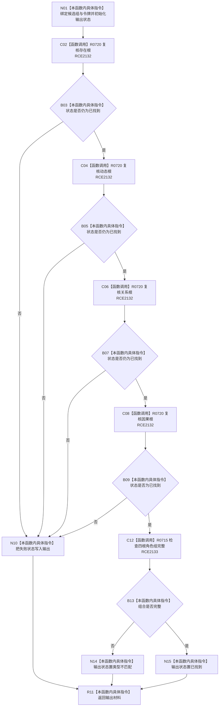

# CF-L9-0126 复核根角色组已许可现状流程图

图类型：现状流程图
代码版本：`03a8b7ac099ccea83e57f2696e2290b7bcdfacaf`
当前工作区复核基线：`b8a49bcb141d4fb8940225954dc328e54600030b`
源码 blob：`ab7997e84df13fa2105b364f0fdb369d47d9c181`
覆盖文件：`海中鱼巣/领域/数据操作.概念图结构.ixx:366-391`
唯一根函数：R0719
完整签名：`海中鱼巣::概念根角色组值式材料 海中鱼巣::概念图结构数据操作::复核根角色组_已许可(const 海中鱼巣::概念根候选组& 候选组, const 海中鱼巣::结构事务令牌& 令牌) const`
参数：`候选组` 与 `令牌` 均只读借用；调用方负责许可有效性
返回结果：首个单根失败状态、四根组合类型不匹配，或已找到的完整根角色组材料
调用图：`流程图/主程序可达调用关系/00_main可达函数身份表.md`、`01_main可达项目调用边表.md`、`02_main可达外部边界表.md`
已登记调用方：R0717（RCE2130）
直接项目函数：R0720（RCE2132）、R0715（RCE2133）
外部边界：无
逐行映射表：`流程图/代码流程图/L9/CF-L9-0126_复核根角色组已许可_逐行代码映射表.md`
输入契约 / 调用语境表：本图内嵌审查；有效许可下按存在、动态、关系、因果顺序复核
非成功返回二分审查表：本图内嵌审查；单根结构状态直接传播，四根组合不完整映射为类型不匹配
偏差清单：无独立文件；本批只记录当前代码事实
依据提交 / 结构化消息：冻结源码提交 `03a8b7ac099ccea83e57f2696e2290b7bcdfacaf` 与正式稳定边表
验证输出：Mermaid / 节点集合 / 逐行覆盖 PASS；目标 no-index 与全仓 diff 检查 PASS；strict 108/108 PASS；未构建、未运行
不得作为施工许可：是
不得宣称：令牌有效或四根当前可读

## 流程图

## 当前边界

- 后续根只在前一根保持 `已找到` 时复核；首个失败状态终止剩余读取并原样写入输出。
